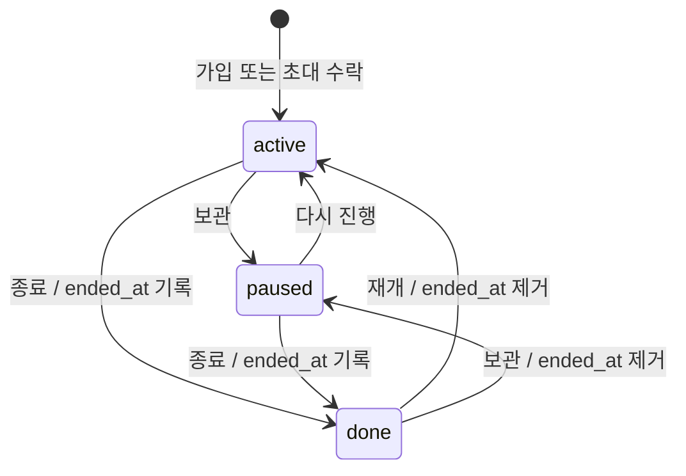
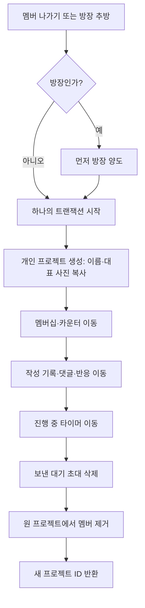

# 기능 요구사항 분석

기능 요구사항 출처: 「뜨개로그 백엔드 기능정의서」 14쪽에 대한 기존 분석입니다. 기존 분석은 PDF 7, 9, 10쪽의 표·관계도를 포함합니다. 기능 요구사항과 앱 코드가 충돌하면 PDF를 기준으로 합니다.

기존 분석 기준: `feat/sdk-ci-prisma-skills` 브랜치의 `59c92ad` 커밋입니다. 이번 문서 갱신에서는 원본 PDF를 다시 확인하지 않았습니다. 기존 기능 ID와 원문 쪽을 유지합니다.

DB 표준 출처: 2026-10-09 사용자 추가 요구사항입니다. 이 표준은 앞으로 작성할 테이블 설계와 DDL에 적용합니다. 문서와 로컬 스키마 갱신은 실제 DB 반영 승인을 뜻하지 않습니다.

구조 설계 출처: 2026-10-10에 사용자가 승인한 ERD 피드백입니다. 개인 작업 공간 분리, 이관 이력과 복구 경계를 로컬 설계에 반영합니다. 실제 DB 반영과 배포는 승인 범위에 포함하지 않습니다.

정책 확정 출처: 2026-10-10에 사용자가 미결 사항의 권장안을 확정 요구사항으로 반영하도록 지시했습니다. 6절은 기존 미정·선택 항목의 확정 기준입니다. 기존 PDF 분석과 충돌하는 경우 이 추가 요구사항을 우선합니다. 7절은 사용자가 추가한 API 버저닝 요구사항입니다. 정책 확정은 코드·스키마 반영이나 검증 완료를 뜻하지 않습니다.

작성 방식: ASD-STE100의 명확한 문장 원칙을 한국어에 적용합니다. 공식 표준 준수를 뜻하지 않습니다.

**확정**은 PDF 또는 사용자 추가 요구사항으로 동작을 정한 상태입니다. 기능 추적표의 확정 상태는 구현 완료를 뜻하지 않습니다. 초기 버전에서 제외한 기능은 6절에 명시합니다. ID는 기능 추적 단위이며 별도 엔드포인트를 뜻하지 않습니다.

## 공통 규칙

- 상태·실·바늘·카운터·타이머·기록은 멤버 개인 소유입니다.
- 상태는 active, paused, done입니다. done 진입 시 ended_at을 기록합니다. 다른 상태로 바꾸면 ended_at을 지웁니다.
- 같은 프로젝트 멤버는 프로필 공개 범위와 무관하게 프로젝트의 진행상황과 기록을 봅니다. 차단 관계인 사용자의 데이터는 제외합니다.
- 이관 때 작성자가 아닌 사람의 댓글·반응도 기록과 함께 보존합니다.
- 차단은 양방향 숨김입니다. 검색·프로필·게시글·댓글·프로젝트 기록을 숨깁니다.
- 프로필 기록·총 시간은 공개 범위로 제한합니다. 피드 게시글은 공개 범위와 무관하게 노출합니다.
- 사용자 간 조회는 차단 여부, 현재 프로젝트 참여 권한 또는 공개 범위의 순서로 판단합니다. 차단으로 숨긴 데이터는 목록·검색·집계에서도 제외합니다.

## 기능별 추적표

| ID | 원문 쪽 | 행위자 | 선행 조건 | 입력 | 성공 기준 | 거부 조건 | 수용 기준 | 상태 |
|---|---:|---|---|---|---|---|---|---|
| V1-101 | 2 | 가입 사용자 | 인증 불필요 | 화면 값 및 대상 ID | 고유한 로그인 ID 생성; 응답에서 타인에게 노출하지 않음 | 인증 부족, 대상 부재, 권한 부족 또는 차단 관계 | 로그인 아이디 가입 결과·권한·거부 동작 검증 | 확정 |
| V1-102 | 2 | 가입 사용자 | 인증 불필요 | 화면 값 및 대상 ID | 고유 handle 생성; 변경 가능 | 인증 부족, 대상 부재, 권한 부족 또는 차단 관계 | 계정 ID 가입 결과·권한·거부 동작 검증 | 확정 |
| V1-103 | 2 | 가입 사용자 | 인증 불필요 | 화면 값 및 대상 ID | 계정 생성 후 로그인 토큰 발급 | 인증 부족, 대상 부재, 권한 부족 또는 차단 관계 | 닉네임·비밀번호 가입 결과·권한·거부 동작 검증 | 확정 |
| V1-104 | 2 | 가입 사용자 | 인증 불필요 | 화면 값 및 대상 ID | 동의 시각과 약관 버전 저장 | 인증 부족, 대상 부재, 권한 부족 또는 차단 관계 | 약관 동의 저장 결과·권한·거부 동작 검증 | 확정 |
| V1-105 | 2 | 로그인 사용자 | 인증 불필요 | 화면 값 및 대상 ID | 일치 여부를 노출하지 않고 토큰 발급 | 인증 부족, 대상 부재, 권한 부족 또는 차단 관계 | 로그인 결과·권한·거부 동작 검증 | 확정 |
| V1-106 | 2 | 로그인 사용자 | 계정 또는 세션 존재 | 화면 값 및 대상 ID | 토큰 갱신 | 인증 부족, 대상 부재, 권한 부족 또는 차단 관계 | 토큰 갱신 결과·권한·거부 동작 검증 | 확정 |
| V1-107 | 2 | 가입 사용자 | 이메일·전화번호 미수집; 유효한 일회용 복구 코드 보유 | 로그인 ID·복구 코드·새 비밀번호 | 비밀번호 재설정; 코드 교체; 기존 세션·접근 토큰 무효화 | 코드 불일치·재사용·시도 제한 초과 | 코드 원문 미저장; 동시 재사용 거부; 과거 토큰 거부 | 확정 |
| V1-108 | 2 | 가입 사용자 | 인증 불필요 | 화면 값 및 대상 ID | 로그인 없이 정책 문서 조회 | — | 정책 문서 조회 결과·권한·거부 동작 검증 | 확정 |
| V1-109 | 2 | 로그인 사용자 | 계정 또는 세션 존재 | 화면 값 및 대상 ID | 로그아웃 | 인증 부족, 대상 부재, 권한 부족 또는 차단 관계 | 로그아웃 결과·권한·거부 동작 검증 | 확정 |
| V1-110 | 2 | 로그인 사용자 | 계정 또는 세션 존재 | 화면 값 및 대상 ID | 회원 탈퇴 | 인증 부족, 대상 부재, 권한 부족 또는 차단 관계 | 회원 탈퇴 결과·권한·거부 동작 검증 | 확정 |
| V1-201 | 2 | 로그인 사용자 | 유효한 인증 | 화면 값 및 대상 ID | public/friends/private 설정, 기본 public | 인증 부족, 대상 부재, 권한 부족 또는 차단 관계 | 공개 범위 변경 결과·권한·거부 동작 검증 | 확정 |
| V1-202 | 2 | 로그인 사용자 | 유효한 인증 | 화면 값 및 대상 ID | 계정 ID 변경 | 인증 부족, 대상 부재, 권한 부족 또는 차단 관계 | 계정 ID 변경 결과·권한·거부 동작 검증 | 확정 |
| V1-203 | 2 | 로그인 사용자 | 유효한 인증 | 화면 값 및 대상 ID | 소개 변경 | 인증 부족, 대상 부재, 권한 부족 또는 차단 관계 | 소개 변경 결과·권한·거부 동작 검증 | 확정 |
| V1-204 | 2 | 로그인 사용자 | 유효한 인증 | 화면 값 및 대상 ID | 내 통계 조회 | 인증 부족, 대상 부재, 권한 부족 또는 차단 관계 | 내 통계 조회 결과·권한·거부 동작 검증 | 확정 |
| V1-205 | 2 | 로그인 사용자 | 유효한 인증 | 화면 값 및 대상 ID | 내 기록 모아보기 | 인증 부족, 대상 부재, 권한 부족 또는 차단 관계 | 내 기록 모아보기 결과·권한·거부 동작 검증 | 확정 |
| V1-206 | 2 | 로그인 사용자 | 유효한 인증 | 화면 값 및 대상 ID | 프로필 기본 정보 조회 | 인증 부족, 대상 부재, 권한 부족 또는 차단 관계 | 프로필 기본 정보 조회 결과·권한·거부 동작 검증 | 확정 |
| V1-207 | 2 | 로그인 사용자 | 유효한 인증; 차단 관계 아님 | 화면 값 및 대상 ID | 공개 범위로 목록·집계 제한; 공동 프로젝트 권한을 프로필 전체 조회에 사용하지 않음 | 인증 부족, 대상 부재, 권한 부족 또는 차단 관계 | 비공개·친구 범위와 차단 시 목록·집계 비노출 | 확정 |
| V1-208 | 2 | 로그인 사용자 | 유효한 인증; 차단 관계 아님 | 화면 값 및 대상 ID | 게시글은 프로필 공개 범위와 무관하게 노출 | 인증 부족, 대상 부재 또는 차단 관계 | 비공개 프로필의 게시글 조회 허용; 차단 시 비노출 | 확정 |
| V1-209 | 2 | 로그인 사용자 | 유효한 인증 | 화면 값 및 대상 ID | 프로필 메뉴 | 인증 부족, 대상 부재, 권한 부족 또는 차단 관계 | 프로필 메뉴 결과·권한·거부 동작 검증 | 확정 |
| V1-301 | 3 | 로그인 사용자 | 로그인; 차단 관계 제외 | 화면 값 및 대상 ID | 사용자 검색 | 인증 부족, 대상 부재, 권한 부족 또는 차단 관계 | 사용자 검색 결과·권한·거부 동작 검증 | 확정 |
| V1-302 | 3 | 로그인 사용자 | 로그인; 차단 관계 제외 | 화면 값 및 대상 ID | 상대의 대기 요청이 있으면 친구로 전환 | 인증 부족, 대상 부재, 권한 부족 또는 차단 관계 | 친구 요청 전송 결과·권한·거부 동작 검증 | 확정 |
| V1-303 | 3 | 로그인 사용자 | 로그인; 차단 관계 제외 | 화면 값 및 대상 ID | 요청 수락·거절 | 인증 부족, 대상 부재, 권한 부족 또는 차단 관계 | 요청 수락·거절 결과·권한·거부 동작 검증 | 확정 |
| V1-304 | 3 | 로그인 사용자 | 로그인; 차단 관계 제외 | 화면 값 및 대상 ID | 보낸 요청 취소 | 인증 부족, 대상 부재, 권한 부족 또는 차단 관계 | 보낸 요청 취소 결과·권한·거부 동작 검증 | 확정 |
| V1-305 | 3 | 로그인 사용자 | 로그인; 차단 관계 제외 | 화면 값 및 대상 ID | 친구 목록·해제 | 인증 부족, 대상 부재, 권한 부족 또는 차단 관계 | 친구 목록·해제 결과·권한·거부 동작 검증 | 확정 |
| V1-306 | 3 | 로그인 사용자 | 로그인; 차단 관계 제외 | 화면 값 및 대상 ID | 요청 배지 | 인증 부족, 대상 부재, 권한 부족 또는 차단 관계 | 요청 배지 결과·권한·거부 동작 검증 | 확정 |
| V1-401 | 4 | 로그인 사용자 | 방장 전용 작업은 방장 권한 | 화면 값 및 대상 ID | 방장 1명인 비공개 프로젝트 생성 | 인증 부족, 대상 부재, 권한 부족 또는 차단 관계 | 프로젝트 생성 결과·권한·거부 동작 검증 | 확정 |
| V1-402 | 4 | 로그인 사용자 | 프로젝트 멤버; 방장 전용 작업은 방장 권한 | 화면 값 및 대상 ID | 개인 멤버십과 기본 카운터 2개 생성 | 인증 부족, 대상 부재, 권한 부족 또는 차단 관계 | 내 멤버십 생성 결과·권한·거부 동작 검증 | 확정 |
| V1-403 | 4 | 로그인 사용자 | 프로젝트 멤버; 방장 전용 작업은 방장 권한 | 화면 값 및 대상 ID | 프로젝트 생성과 초대를 한 트랜잭션으로 처리 | 인증 부족, 대상 부재, 권한 부족 또는 차단 관계 | 생성과 함께 친구 초대 결과·권한·거부 동작 검증 | 확정 |
| V1-404 | 4 | 로그인 사용자 | 프로젝트 멤버; 방장 전용 작업은 방장 권한 | 화면 값 및 대상 ID | 프로젝트 목록 조회 | 인증 부족, 대상 부재, 권한 부족 또는 차단 관계 | 프로젝트 목록 조회 결과·권한·거부 동작 검증 | 확정 |
| V1-405 | 4 | 로그인 사용자 | 프로젝트 멤버; 방장 전용 작업은 방장 권한 | 화면 값 및 대상 ID | 상태 정렬·필터 | 인증 부족, 대상 부재, 권한 부족 또는 차단 관계 | 상태 정렬·필터 결과·권한·거부 동작 검증 | 확정 |
| V1-406 | 4 | 로그인 사용자 | 현재 프로젝트 멤버 | 화면 값 및 대상 ID | 차단 관계를 제외한 멤버 진행상황 조회 | 인증 부족, 대상 부재, 참여 종료 또는 차단 관계 | 공개 범위와 무관한 공동 프로젝트 조회; 차단 데이터·집계 제외 | 확정 |
| V1-407 | 4 | 로그인 사용자 | 프로젝트 멤버; 방장 전용 작업은 방장 권한 | 화면 값 및 대상 ID | 프로젝트·내 멤버십 수정 | 인증 부족, 대상 부재, 권한 부족 또는 차단 관계 | 프로젝트·내 멤버십 수정 결과·권한·거부 동작 검증 | 확정 |
| V1-408 | 4 | 로그인 사용자 | 현재 프로젝트 멤버; 본인 작업 공간 | 화면 값 및 대상 ID | done 진입 때 ended_at 설정, 그 외에는 제거 | 인증 부족, 대상 부재, 타인 작업 공간 또는 미종료 타이머 | 본인 상태만 전환; 실행·일시정지 타이머 종료 전 done 전환 거부 | 확정 |
| V1-409 | 4 | 로그인 사용자 | 프로젝트 멤버; 방장 전용 작업은 방장 권한 | 화면 값 및 대상 ID | 프로젝트 삭제 | 인증 부족, 대상 부재, 권한 부족 또는 차단 관계 | 프로젝트 삭제 결과·권한·거부 동작 검증 | 확정 |
| V1-501 | 4 | 로그인 사용자 | 프로젝트 멤버; 방장 전용 작업은 방장 권한 | 화면 값 및 대상 ID | 친구 초대 | 인증 부족, 대상 부재, 권한 부족 또는 차단 관계 | 친구 초대 결과·권한·거부 동작 검증 | 확정 |
| V1-502 | 4 | 로그인 사용자 | 프로젝트 멤버; 방장 전용 작업은 방장 권한 | 화면 값 및 대상 ID | 초대 취소 | 인증 부족, 대상 부재, 권한 부족 또는 차단 관계 | 초대 취소 결과·권한·거부 동작 검증 | 확정 |
| V1-503 | 4 | 로그인 사용자 | 프로젝트 멤버; 방장 전용 작업은 방장 권한 | 화면 값 및 대상 ID | 받은 초대 목록 | 인증 부족, 대상 부재, 권한 부족 또는 차단 관계 | 받은 초대 목록 결과·권한·거부 동작 검증 | 확정 |
| V1-504 | 4 | 로그인 사용자 | 방장 전용 작업은 방장 권한 | 화면 값 및 대상 ID | 수락 시 active 멤버십 및 기본 카운터 생성 | 인증 부족, 대상 부재, 권한 부족 또는 차단 관계 | 초대 수락·거절 결과·권한·거부 동작 검증 | 확정 |
| V1-505 | 4 | 로그인 사용자 | 프로젝트 멤버; 방장 전용 작업은 방장 권한 | 화면 값 및 대상 ID | 새 방장 지정, 이전 방장은 일반 멤버 | 인증 부족, 대상 부재, 권한 부족 또는 차단 관계 | 방장 양도 결과·권한·거부 동작 검증 | 확정 |
| V1-506 | 4 | 로그인 사용자 | 현재 프로젝트 방장; 추방 대상은 방장 아님 | 대상 멤버 ID·작업 식별자 | 개인 프로젝트 생성; 기존 참여 종료; 작업 공간 귀속 변경; 카운터·타이머·기록·댓글·반응 보존 | 인증 부족, 대상 부재, 방장 권한 부족 또는 입력 불일치 | 같은 트랜잭션 처리; 식별자 보존; 실패 롤백; 재시도 중복 방지 | 확정 |
| V1-507 | 4 | 로그인 사용자 | 현재 프로젝트 멤버; 방장은 후임 지정 | 작업 식별자·필요한 후임 ID | 개인 프로젝트 생성; 기존 참여 종료; 작업 공간·타이머 보존; 새 프로젝트 ID 반환 | 인증 부족, 대상 부재, 후임 미지정 또는 입력 불일치 | 카운터·기록·댓글·반응 식별자 보존; 원 참여 이력 유지; 재시도 결과 일치 | 확정 |
| V1-508 | 4 | 로그인 사용자 | 프로젝트 멤버; 방장 전용 작업은 방장 권한 | 화면 값 및 대상 ID | 멤버 보기·프로필 이동 | 인증 부족, 대상 부재, 권한 부족 또는 차단 관계 | 멤버 보기·프로필 이동 결과·권한·거부 동작 검증 | 확정 |
| V1-601 | 5 | 로그인 사용자 | 프로젝트 멤버; done 상태가 아님 | 화면 값 및 대상 ID | 타이머 기록 작성 | 인증 부족, 대상 부재, 권한 부족 또는 차단 관계 | 타이머 기록 작성 결과·권한·거부 동작 검증 | 확정 |
| V1-602 | 5 | 로그인 사용자 | 프로젝트 멤버; done 상태가 아님 | 화면 값 및 대상 ID | 직접 기록 추가 | 인증 부족, 대상 부재, 권한 부족 또는 차단 관계 | 직접 기록 추가 결과·권한·거부 동작 검증 | 확정 |
| V1-603 | 5 | 로그인 사용자 | 프로젝트 멤버; done 상태가 아님 | 화면 값 및 대상 ID | 기록 본문 작성 | 인증 부족, 대상 부재, 권한 부족 또는 차단 관계 | 기록 본문 작성 결과·권한·거부 동작 검증 | 확정 |
| V1-604 | 5 | 로그인 사용자 | 현재 프로젝트 멤버; 기록 작성자 | 화면 값 및 대상 ID | done에서도 자신의 기존 기록 수정·삭제 허용 | 인증 부족, 대상 부재 또는 타인 기록 | 본인 기록만 변경; 총 시간 재계산; 작업 공간 version 증가 | 확정 |
| V1-605 | 5 | 로그인 사용자 | 현재 프로젝트 멤버; 차단 관계 아님 | 화면 값 및 대상 ID | done에서도 멤버 기록 조회 | 인증 부족, 대상 부재, 참여 종료 또는 차단 관계 | 차단 우선 적용; 이관 후 현재 프로젝트 참여 권한 재검사 | 확정 |
| V1-606 | 5 | 로그인 사용자 | 현재 프로젝트 멤버; 기록 접근 가능 | 화면 값 및 대상 ID | done에서도 허용된 반응 추가·취소 | 인증 부족, 대상 부재, 권한 부족 또는 차단 관계 | 허용 코드 검사; 중복 반응 방지; done에서 처리 허용 | 확정 |
| V1-607 | 5 | 로그인 사용자 | 현재 프로젝트 멤버; 기록 접근 가능 | 화면 값 및 대상 ID | done에서도 댓글 작성; 작성자만 삭제; 차단 댓글 숨김 | 인증 부족, 대상 부재, 권한 부족 또는 차단 관계 | 작성자 정보만으로 이관 후 접근 불가; 차단 댓글 비노출 | 확정 |
| V1-701 | 6 | 로그인 사용자 | 현재 프로젝트 멤버; done 상태가 아님 | 작업 공간 ID·기대 version·작업 식별자 | 서버에 타이머 상태 저장; 시작 시각·누적 시간으로 기기 간 이어하기 | 인증 부족, 참여 종료, 중복 실행 또는 version 충돌 | 작업 공간당 실행 타이머 1개; 동시 명령·재시도·이관 상태 보존 | 확정 |
| V1-702 | 6 | 로그인 사용자 | 프로젝트 멤버; done 상태가 아님 | 화면 값 및 대상 ID | 타이머 종료 | 인증 부족, 대상 부재, 권한 부족 또는 차단 관계 | 타이머 종료 결과·권한·거부 동작 검증 | 확정 |
| V1-703 | 6 | 로그인 사용자 | 프로젝트 멤버; done 상태가 아님 | 화면 값 및 대상 ID | 0 미만 불가; 목표 초과 허용 | 인증 부족, 대상 부재, 권한 부족 또는 차단 관계 | 카운터 ±1 결과·권한·거부 동작 검증 | 확정 |
| V1-704 | 6 | 로그인 사용자 | 프로젝트 멤버; done 상태가 아님 | 화면 값 및 대상 ID | 카운터 추가·삭제 | 인증 부족, 대상 부재, 권한 부족 또는 차단 관계 | 카운터 추가·삭제 결과·권한·거부 동작 검증 | 확정 |
| V1-705 | 6 | 로그인 사용자 | 프로젝트 멤버; done 상태가 아님 | 화면 값 및 대상 ID | 카운터 수정 | 인증 부족, 대상 부재, 권한 부족 또는 차단 관계 | 카운터 수정 결과·권한·거부 동작 검증 | 확정 |
| V1-706 | 6 | 로그인 사용자 | 프로젝트 멤버; done 상태가 아님 | 화면 값 및 대상 ID | 카운터 표시·순서 | 인증 부족, 대상 부재, 권한 부족 또는 차단 관계 | 카운터 표시·순서 결과·권한·거부 동작 검증 | 확정 |
| V1-707 | 6 | 로그인 사용자 | 프로젝트 멤버; done 상태가 아님 | 화면 값 및 대상 ID | 카운터 초기화 | 인증 부족, 대상 부재, 권한 부족 또는 차단 관계 | 카운터 초기화 결과·권한·거부 동작 검증 | 확정 |
| V1-801 | 6 | 로그인 사용자 | 인증; 대상 게시글 또는 사용자 접근 가능 | 화면 값 및 대상 ID | 최신순·커서 페이지·차단 관계 제외 | 인증 부족, 대상 부재, 권한 부족 또는 차단 관계 | 피드 조회 결과·권한·거부 동작 검증 | 확정 |
| V1-802 | 6 | 로그인 사용자 | 인증; 대상 게시글 또는 사용자 접근 가능 | 화면 값 및 대상 ID | 게시글 작성 | 인증 부족, 대상 부재, 권한 부족 또는 차단 관계 | 게시글 작성 결과·권한·거부 동작 검증 | 확정 |
| V1-803 | 6 | 로그인 사용자 | 인증; 대상 게시글 또는 사용자 접근 가능 | 화면 값 및 대상 ID | 작성자만 게시글 삭제 | 인증 부족, 대상 부재, 권한 부족 또는 차단 관계 | 게시글 삭제 결과·권한·거부 동작 검증 | 확정 |
| V1-804 | 6 | 로그인 사용자 | 인증; 대상 게시글 또는 사용자 접근 가능 | 화면 값 및 대상 ID | 좋아요 전환 | 인증 부족, 대상 부재, 권한 부족 또는 차단 관계 | 좋아요 전환 결과·권한·거부 동작 검증 | 확정 |
| V1-805 | 6 | 로그인 사용자 | 인증; 대상 게시글 또는 사용자 접근 가능 | 화면 값 및 대상 ID | 게시글 댓글 | 인증 부족, 대상 부재, 권한 부족 또는 차단 관계 | 게시글 댓글 결과·권한·거부 동작 검증 | 확정 |
| V1-901 | 6 | 로그인 사용자 | 인증; 대상 게시글 또는 사용자 접근 가능 | 화면 값 및 대상 ID | 사유·상세 저장; 선택 시 차단도 수행 | 인증 부족, 대상 부재, 권한 부족 또는 차단 관계 | 신고 결과·권한·거부 동작 검증 | 확정 |
| V1-902 | 6 | 로그인 사용자 | 인증; 대상 게시글 또는 사용자 접근 가능 | 화면 값 및 대상 ID | 차단 저장; 두 사용자 사이의 친구·대기 요청·대기 초대 종료; 공동 프로젝트 참여 유지 | 차단 관계이면 새 요청·초대 거부 | 같은 트랜잭션 처리; 제3자 관계 보존; 공동 프로젝트에서도 차단 데이터 비노출 | 확정 |
| V1-903 | 6 | 로그인 사용자 | 인증; 대상 게시글 또는 사용자 접근 가능 | 화면 값 및 대상 ID | 차단 목록·해제 | 인증 부족, 대상 부재, 권한 부족 또는 차단 관계 | 차단 목록·해제 결과·권한·거부 동작 검증 | 확정 |

## 상태 전이

PDF는 done 상태에서 새 기록·타이머·카운터 입력을 막습니다. 추가 요구사항은 done 상태에서도 본인의 기존 기록 수정·삭제와 접근 가능한 기록의 조회·댓글·반응을 허용합니다.

## 나가기·추방 이관

## 정책 분석

위 이관 그림은 기존 PDF 분석의 기능 흐름입니다. 새 설계는 멤버십 행을 이동하지 않습니다. 기존 참여를 종료하고 개인 작업 공간을 이동합니다. 카운터·기록·댓글·반응은 같은 작업 공간 아래에 보존합니다.

- **멤버십 개인 소유**: 프로젝트는 공유 공간입니다. 상태·실·바늘·카운터·타이머·작성 기록은 멤버에 귀속됩니다.
- **done 상태**: 기록 생성·타이머·카운터 입력은 금지됩니다. 본인의 기존 기록 수정·삭제는 허용합니다. 현재 접근 권한이 있으면 기록 조회·댓글·반응도 허용합니다.
- **이관 트랜잭션**: PDF는 이관 전체를 한 트랜잭션으로 규정합니다. 다른 작성자의 댓글·반응은 원 기록에 붙인 채 보존합니다.
- **양방향 차단**: 사용자 간 노출은 양쪽에서 막습니다. 두 사용자 사이의 친구 관계와 대기 요청·초대를 종료합니다. 같은 프로젝트 멤버십과 제3자 관계는 유지합니다.
- **공개 범위와 공동 프로젝트**: 프로필 기록 조회는 public/friends/private 정책을 적용합니다. 같은 프로젝트의 기록 조회는 별도 권한입니다. 게시글 공개는 프로필 공개 범위와 무관합니다.
- **차단 우선**: 공동 프로젝트 참여는 차단된 상대의 데이터 조회 권한을 부여하지 않습니다. 본인 작업 공간과 차단 관계가 아닌 멤버의 데이터는 기존 권한으로 조회합니다.
- PDF의 17개 모델 제안에는 약관 동의와 세션 저장 요구가 충분히 반영되지 않았습니다. 최종 ERD로 확정하지 않습니다.

## 4. DB 표준 (PostgreSQL)

### 4.1. 적용 범위

- DB 객체 이름은 소문자 `snake_case`를 사용합니다.
- 객체 이름과 코드값은 ASCII를 사용합니다. 사용자 입력 본문과 표시 이름에는 이 제한을 적용하지 않습니다.
- 객체 이름은 큰따옴표 없이 사용할 수 있어야 합니다. 대문자, 공백, 예약어 등 인용이 필요한 이름은 사용하지 않습니다.
- ORM이 소문자 이름을 큰따옴표로 감싼 SQL을 생성하는 것은 객체 이름 위반과 구분합니다.
- 아래 업무 예시는 네이밍 예시입니다. 뜨개로그에 청구 도메인이나 해당 테이블을 추가하는 요구사항이 아닙니다.
- 테이블 접두어 `tb_`는 예시에 사용합니다. 모든 테이블의 필수 접두어인지는 테이블 설계에서 확인합니다.

### 4.2. 네이밍 규칙

| 항목 | 규칙 | 올바른 예 | 잘못된 예 | 미준수 시 문제점 |
|---|---|---|---|---|
| 식별자 공통 | ASCII 소문자, 숫자, 밑줄을 사용합니다. 첫 문자는 소문자 또는 밑줄로 제한합니다. 인용이 필요한 이름은 금지합니다. | `tb_invoice_master` | `"InvoiceMaster"` | 대소문자를 보존한 이름은 쿼리에서 인용을 누락하면 찾지 못할 수 있습니다. |
| 길이 한계 | 식별자는 63바이트 이내로 제한합니다. 접두어와 자동 생성 접미어도 포함합니다. 코드값은 대상 컬럼의 길이 제한에 맞춰 사전 검증합니다. | `ck_invoice_master_amt_positive` | 한글 식별자, 63바이트를 초과한 식별자, 컬럼 한도를 초과한 코드값 | 식별자 절단으로 이름 충돌이 발생할 수 있습니다. 긴 코드값은 저장 오류를 발생시킬 수 있습니다. |
| 스키마 | 업무 도메인 단위의 소문자 이름을 사용합니다. 모든 업무 테이블을 `public`에 직접 적재하는 설계는 지양합니다. | `billing`, `crm` | 업무 구분 없이 `public`에 전체 적재 | 도메인별 권한과 백업·복원 범위를 구분하기 어렵습니다. |
| 시퀀스 | 자동 증가 정수 컬럼에는 `IDENTITY`를 권장합니다. 시퀀스 이름은 `{테이블}_{컬럼}_seq` 형식을 유지합니다. | `tb_invoice_master_invoice_seq_seq` | `seq1` | 테이블과 시퀀스의 연결을 파악하기 어렵습니다. 복원 후 값 점검에서 누락이 발생할 수 있습니다. |
| 제약·인덱스 | 기본 키는 `pk_{테이블}`로 명명합니다. 일반 인덱스는 `ix_`, 고유 제약·인덱스는 `ux_`, 검사 제약은 `ck_` 접두어를 명시합니다. | `pk_tb_invoice_master`, `ck_invoice_master_total_amt_positive` | 명명 규칙 없이 자동 생성명에 의존 | 환경별 객체 비교와 마이그레이션 검토가 어려워질 수 있습니다. |
| 파티션 | 파티션 이름은 `{부모}_p{기준값}` 형식으로 지정합니다. | `tb_access_log_p202606` | `log_new`, `log_final2` | 보존기간 배치가 대상 파티션을 식별하기 어렵습니다. |
| 함수·프로시저 | 함수는 `fn_`, 프로시저는 `sp_` 뒤에 동사와 목적어를 붙입니다. 트리거 함수는 `tf_` 접두어를 사용합니다. | `fn_calc_monthly_billing(p_month)` | `f1()` | 운영 객체의 목적과 권한 부여 대상을 파악하기 어렵습니다. |
| ENUM·타입 | ENUM은 `e_{의미}`, 사용자 정의 타입은 `t_{의미}`로 명명합니다. | `e_invoice_status`, `t_billing_summary` | `myenum` | 타입의 의미와 의존 객체를 파악하기 어렵습니다. |
| 파라미터·변수 | 파라미터에는 `p_`, 로컬 변수에는 `v_` 접두어를 사용합니다. SQL 컬럼 참조에는 필요한 테이블 별칭을 명시합니다. | `p_invoice_month`, `v_total_amt` | 컬럼과 같은 이름의 파라미터, `WHERE invoice_month = invoice_month` | 이름이 모호해 오류가 발생하거나 의도하지 않은 전체 행 처리가 발생할 수 있습니다. |

`fk_`는 외래 키의 일반 명명 접두어입니다. 본 프로젝트는 물리 FK를 생성하지 않으므로 해당 접두어를 사용하는 FK 제약도 생성하지 않습니다.

63바이트는 PostgreSQL 기본 빌드의 식별자 한계입니다. 문자열 컬럼의 길이 제한은 식별자 바이트 제한과 별개입니다. `varchar(64)`의 64는 문자 수입니다. ASCII 코드값은 문자 수와 바이트 수가 같습니다.

`IDENTITY`는 UUID 등 다른 식별자 타입을 금지하는 규칙이 아닙니다. 식별자 타입은 테이블 설계에서 결정합니다. `IDENTITY`만으로 고유성을 보장한다고 가정하지 않습니다.

### 4.3. 공통 컬럼과 논리삭제

| 컬럼 | 요구사항 |
|---|---|
| `created_at` | 시스템은 행의 생성 시각을 저장합니다. |
| `created_by` | 시스템은 행을 생성한 주체의 식별자를 저장합니다. |
| `updated_at` | 시스템은 행의 최근 변경 시각을 저장합니다. |
| `updated_by` | 시스템은 행을 최근 변경한 주체의 식별자를 저장합니다. |
| `deleted_at` | 삭제되지 않은 행은 `NULL`을 유지합니다. 논리삭제 시 시스템은 삭제 시각을 저장합니다. |

- 업무 테이블은 위 공통 컬럼을 적용합니다.
- 생성·변경 주체는 서버가 확인한 인증 주체를 기준으로 기록합니다. 클라이언트가 보낸 감사 컬럼 값을 그대로 신뢰하지 않습니다.
- 시스템 작업의 주체 표기와 생성 시 `updated_at`·`updated_by`의 초기값은 테이블 설계에서 정합니다.
- 논리삭제는 기본 업무 조회에서 제외합니다.
- 관계를 새로 생성하거나 변경할 때는 논리삭제된 대상을 유효한 대상으로 취급하지 않습니다.
- 이력 보존과 데이터 이관은 기존 기능 요구사항을 유지합니다. 콘텐츠 복구 경계는 승인한 구조 설계를 따릅니다. 물리 제거와 계정 고유값 재사용은 6절의 확정 정책을 따릅니다.

### 4.4. 물리 FK 미적용과 관계 관리

**DB-FK-001.** 시스템은 업무 테이블 사이에 물리 `FOREIGN KEY` 제약을 생성하지 않습니다. 관계는 비즈니스 계층에서 관리합니다.

**DB-FK-002.** 테이블은 관계 대상의 식별자 컬럼을 유지합니다. 설계 문서와 ERD는 논리 관계와 소유권을 표시합니다.

**DB-FK-003.** 물리 FK 미사용은 `PRIMARY KEY`, `UNIQUE`, `NOT NULL`, `CHECK` 또는 조회 인덱스를 제거하는 근거가 아닙니다. 시스템은 필요한 제약과 인덱스를 유지합니다.

**DB-FK-004.** 비즈니스 계층은 관계를 생성하거나 변경하기 전에 대상의 존재, 논리삭제 여부, 소유권, 멤버십과 권한을 검증합니다. 대상이 없거나 권한이 없으면 변경을 거부합니다.

**DB-FK-005.** 관련 행을 함께 변경하는 작업은 하나의 트랜잭션으로 처리합니다. 생성과 초대, 방장 양도, 나가기와 추방 이관은 부분 완료 상태를 남기지 않습니다.

**DB-FK-006.** 관계 확인 뒤 대상이 변경되거나 삭제되는 동시성 문제를 방지해야 합니다. 구현 설계는 잠금, 격리 수준 또는 버전 검증 등 해당 작업의 보호 방법을 명시합니다. 트랜잭션 사용만으로 관계 무결성을 보장한다고 가정하지 않습니다.

**DB-FK-007.** 대상 삭제 시 비즈니스 계층은 종속 데이터의 보존, 차단, 이동 또는 논리삭제를 명시적으로 처리합니다. DB의 `ON DELETE CASCADE` 동작에 의존하지 않습니다. 탈퇴·프로젝트 삭제에는 6절의 정책과 승인한 복구 경계를 적용합니다.

**DB-FK-008.** ORM 호출, 일괄 입력, 관리 스크립트와 raw SQL 등 모든 쓰기 경로에 같은 관계 규칙을 적용합니다. ORM의 관계 선언만으로 검증이 완료되었다고 가정하지 않습니다.

**DB-FK-009.** 테스트는 대상 부재, 논리삭제된 대상, 타인 소유 데이터, 동시 삭제·생성, 이관 실패의 롤백을 검증해야 합니다. 이관 후 댓글·반응의 관계 보존도 검증해야 합니다.

감사 컬럼의 `created_by`와 `updated_by`도 물리 FK 없이 관리합니다. 사용자 탈퇴 후 감사 주체의 보존·표시 방법은 탈퇴 정책과 함께 결정합니다.

### 4.5. DDL 변경과 운영 반영

- DDL 변경은 발주사 승인 후 반영합니다.
- 승인 대상에는 테이블, 컬럼, 제약, 인덱스, 스키마, 타입, 시퀀스, 함수, 트리거와 파티션의 변경을 포함합니다.
- 변경 요청은 대상 객체, 변경 이유, 영향 범위, 검증 결과와 롤백 방법을 포함합니다.
- 운영 DB에서 직접 DDL을 실행하는 행위는 금지합니다.
- 승인된 변경은 검토된 마이그레이션과 승인된 반영 절차로 적용합니다.
- 요구사항 문서 수정, 로컬 검증 또는 빌드 성공은 DDL 반영 승인을 대신하지 않습니다.
- 발주사 DDL 승인과 사용자의 push·배포 승인은 별개입니다. push와 배포는 현재 요청의 명시적 승인이 필요합니다.

### 4.6. 설계 수용 기준과 검증 한계

| ID | 수용 기준 |
|---|---|
| DB-AC-001 | 모든 설계 식별자는 ASCII 소문자 `snake_case`를 사용하며 63바이트 이내입니다. |
| DB-AC-002 | 설계는 업무 스키마, 객체 명명 규칙, 공통 컬럼과 논리삭제 정책을 표시합니다. |
| DB-AC-003 | 검토된 마이그레이션은 물리 FK를 생성하지 않습니다. 구현 검증 시 격리된 테스트 DB의 업무 스키마에 FK 제약이 없는지 확인합니다. |
| DB-AC-004 | 각 논리 관계는 검증 책임, 동시성 보호와 대상 삭제 시 처리 규칙을 가집니다. 확정 정책과 아직 구현하지 않은 설계를 구분합니다. |
| DB-AC-005 | 실패·동시성 테스트는 관계 위반과 부분 이관을 방지하는지 검증합니다. |
| DB-AC-006 | DDL 변경 기록은 발주사 승인과 반영 절차를 추적할 수 있습니다. |

## 5. 승인한 구조 설계

| ID | 요구사항 |
|---|---|
| DB-DS-001 | 멤버십은 참여 기간을 표현합니다. 개인 작업 공간은 작업 상태와 개인 데이터를 소유합니다. 재가입은 새 참여 기간을 생성합니다. |
| DB-DS-002 | 이관은 개인 작업 공간의 귀속을 변경합니다. 변경 전후 관계를 보존합니다. 재시도는 같은 작업 식별자를 사용합니다. 역이관은 이후 변경을 확인합니다. |
| DB-DS-003 | 부모 삭제는 자식의 직접 삭제 상태를 변경하지 않습니다. 복구는 승인한 삭제 작업의 대상만 처리합니다. 관계와 인증 상태를 자동 복구하지 않습니다. |
| DB-DS-004 | DB 제약은 행 내부 무결성과 유효 관계의 중복을 제한합니다. 모든 쓰기 경로는 공통 잠금 순서와 잠금 후 관계 검증을 적용합니다. |
| DB-DS-005 | 신고는 접수 당시 필요한 텍스트 증거를 보존합니다. 서비스 관리 파일은 안정적인 저장 객체를 참조합니다. 복구 가능한 참조의 파일을 보존합니다. |
| DB-DS-006 | 운영 수용은 RPO·RTO, 보존 기간과 책임자를 확정합니다. 실제 DB·파일 복원과 과거 인증 거부를 검증합니다. |

구조와 논리 관계의 상세 기준은 [테이블 설계](erd-design.md)에서 관리합니다. 복구 목표와 서비스 재개 기준은 [데이터 복구 문서](data-recovery.md)에서 관리합니다. 업무 정책은 다음 절의 확정 기준을 따릅니다.

## 6. 확정 업무 정책

### 6.1. 권한·차단·이관

- 차단은 공동 프로젝트 권한보다 우선합니다. 숨긴 기록·댓글·반응·진행상황은 목록과 집계에서도 제외합니다.
- 차단은 두 사용자 사이의 친구 관계와 대기 친구 요청·프로젝트 초대를 같은 트랜잭션에서 종료합니다. 제3자의 요청·초대와 공동 프로젝트 멤버십은 변경하지 않습니다.
- 이관 후 기록·댓글·반응의 접근 권한은 현재 귀속 프로젝트의 유효한 참여와 차단 상태로 판단합니다. 이전 프로젝트의 참여와 댓글 작성 사실만으로 접근을 허용하지 않습니다.
- 이관은 진행 중 타이머를 개인 작업 공간과 함께 보존합니다. 타이머의 소유자와 식별자를 바꾸지 않습니다.
- 프로젝트 삭제는 방장만 수행합니다. 삭제된 부모 아래의 데이터는 조회·변경을 거부합니다. 삭제·복구 표시는 승인한 구조 설계를 따릅니다.

### 6.2. 프로젝트·타이머·카운터

- 프로젝트의 유효한 참여자는 방장을 포함해 최대 20명입니다. 초대 수락 트랜잭션에서 인원 상한을 다시 확인합니다.
- 방장이 나가거나 탈퇴하면 현재 유효한 멤버 중 후임을 직접 지정합니다. 다른 멤버가 있는데 후임을 지정하지 않으면 요청을 거부합니다. 혼자 남은 프로젝트는 종료합니다. 종료된 프로젝트에는 신규 참여와 쓰기를 허용하지 않습니다.
- done 상태에서도 작성자는 자신의 기존 기록을 수정·삭제할 수 있습니다. 변경 후 총 시간을 다시 계산하고 작업 공간의 version을 증가시킵니다.
- 실행 또는 일시정지 상태의 타이머가 있으면 done 전환을 거부합니다. 타이머 종료와 기록 저장을 완료한 뒤 상태를 전환합니다.
- 서버는 타이머의 실행·일시정지 상태, 시작 시각과 누적 시간을 저장합니다. 작업 공간당 실행 타이머는 하나입니다. 다른 기기는 서버 상태를 조회해 이어합니다. 오프라인 신규 시작과 상태 변경은 초기 버전에서 지원하지 않습니다.
- 타이머 종료와 기록 생성은 같은 트랜잭션으로 처리합니다. 같은 작업 식별자의 재시도는 같은 결과를 반환합니다.
- 서버는 카운터 변경을 명령 단위로 반영합니다. 증가·감소는 원자적으로 처리합니다. 설정·초기화·순서 변경은 기대 version을 검사합니다. 오래된 요청을 자동 덮어쓰지 않고 HTTP 409로 거부합니다.
- 카운터 명령은 작업 식별자로 중복 반영을 막습니다. 클라이언트는 실패하거나 응답이 불확실한 변경을 같은 식별자로 재시도합니다. 서버 확인 전 변경을 저장 완료로 표시하지 않습니다.
- 카운터 추가·삭제·표시 여부·표시 순서는 초기 버전에 포함합니다. 기본 카운터 2개는 작업 공간 생성 시 한 번 생성합니다. 순서 변경은 같은 작업 공간의 카운터만 대상으로 합니다.
- 실과 바늘은 초기 버전에서 각각 텍스트 메모로 저장합니다. 구조화된 카탈로그와 복수 항목 모델은 초기 버전에서 제외합니다.

### 6.3. 계정·인증·정책 문서

- 로그인 ID와 handle은 ASCII 소문자·숫자·밑줄·점으로 구성합니다. 길이는 3~32자입니다. 첫 글자와 마지막 글자는 영문 소문자 또는 숫자입니다. 연속된 점은 허용하지 않습니다. 서버는 양끝 공백을 제거하고 영문을 소문자로 정규화한 뒤 고유성을 검사합니다.
- 로그인 ID는 가입 후 변경하지 않습니다. 로그인 ID와 과거에 사용한 handle은 다른 계정에 재발급하지 않습니다. 같은 계정의 과거 handle 복귀는 현재 고유성을 확인한 뒤 허용합니다.
- 초기 버전은 비밀번호 단일 요소 인증을 사용합니다. 비밀번호 길이는 15~128자입니다. 공백과 Unicode를 허용합니다. 비밀번호를 절단하거나 공백 제거·대소문자 변환하지 않습니다. 흔한 비밀번호와 유출된 비밀번호를 거부합니다. 문자 종류 조합과 주기적 변경을 강제하지 않습니다.
- 가입 시 암호학적으로 안전한 일회용 복구 코드를 발급합니다. 사용자에게 원문을 한 번 제공하고 서버에는 해시만 저장합니다. 이메일·전화번호는 수집하지 않습니다.
- 복구 코드 분실 시 현재 비밀번호로 재인증한 사용자는 코드를 재발급할 수 있습니다. 재발급은 이전 코드를 즉시 무효화합니다.
- 복구 코드가 없으면 비밀번호 재설정을 허용하지 않습니다. 운영자는 닉네임·handle·게시글 등의 공개 정보만으로 계정을 복구하지 않습니다.
- 복구 코드 사용은 원자적으로 처리합니다. 사용한 코드를 무효화하고 새 코드를 발급합니다. 비밀번호 재설정 후 기존 갱신 세션과 접근 토큰을 무효화합니다. 로그인·복구 요청에는 시도 제한과 계정 존재를 노출하지 않는 오류 응답을 적용합니다.
- 탈퇴는 즉시 로그인과 현재 세션·접근 토큰을 차단합니다. 계정 복구는 지원하지 않습니다. 방장 후임 처리를 완료하지 못하면 탈퇴 트랜잭션 전체를 거부합니다.
- 탈퇴한 사용자의 작성자 표시는 `탈퇴한 사용자`입니다. 현재 관계와 이관 이력을 유지하는 데 필요한 식별자를 보존합니다. 공개 프로필과 인증 비밀값은 탈퇴 시 제거합니다. 다른 사용자가 참조하는 콘텐츠와 파일을 연쇄 삭제하지 않습니다.
- 물리삭제는 복구 기간 만료, 현재 참조 부재, 이력 보존 조건 충족을 모두 확인한 뒤 수행합니다. 보존 기간 만료만으로 참조 중인 행을 삭제하지 않습니다.
- 초기 정책 문서의 언어는 한국어입니다. 정책 종류별로 효력 시작 시각을 저장합니다. 해당 시각이 지난 버전 중 가장 최근 버전을 활성 버전으로 선택합니다. 같은 종류의 버전과 효력 시작 시각은 중복할 수 없습니다.
- 동의가 참조한 문서 내용은 변경하지 않습니다. 재동의가 필요한 새 버전은 재동의 여부를 명시합니다. 필요한 동의가 없는 사용자의 업무 변경을 거부합니다. 정책 조회·재동의·로그아웃·탈퇴는 허용합니다.
- 이후 재동의가 필요 없는 버전이 활성화돼도 중간 필수 버전의 동의 의무를 해제하지 않습니다. 정책 종류별로 마지막 필수 버전 이상의 효력 시각을 가진 버전에 동의해야 합니다. 현재 활성 버전에 동의하면 이 조건을 충족합니다.
- 시스템 작업의 created_by와 updated_by는 작업 종류별로 등록한 고정 UUID를 사용합니다. 시스템 주체는 사용자 로그인 계정과 분리합니다. 클라이언트가 감사 주체를 지정할 수 없습니다.

### 6.4. 피드·신고

- 피드 조회와 게시글 작성은 초기 버전에 포함합니다. 피드는 created_at과 UUID의 내림차순으로 정렬합니다. 커서는 두 값을 함께 사용합니다. 매 요청에서 현재 차단·삭제 상태를 확인합니다.
- 게시글 삭제는 작성자만 수행합니다. 게시글 수정은 초기 버전에서 제외합니다. updated_at의 존재는 수정 API 지원을 뜻하지 않습니다.
- 기록 반응 코드는 `like`, `heart`, `clap`, `celebrate`, `wow`입니다. 서버는 등록하지 않은 코드를 거부합니다. 화면의 이모지와 저장 코드를 분리합니다.
- 신고 사유 코드는 `spam`, `abuse`, `inappropriate`, `privacy`, `other`입니다. `other`는 상세 내용을 필수로 입력합니다. 운영자는 사유 목록을 바꿀 때 이전 코드의 해석을 유지합니다.
- 초기 버전은 신고 자동 제재를 적용하지 않습니다. 운영자는 권한이 제한된 신고 목록에서 접수·검토·종결 상태를 관리합니다. 숨김·차단 등 조치의 실행 주체, 사유와 결과를 기록합니다. 조치 이력은 일반 사용자가 수정할 수 없습니다.
- 신고 증거는 접수 당시 허용한 텍스트만 보존합니다. 사진 증거의 별도 사본은 초기 버전에서 제외합니다. 신고 대상의 변경·삭제로 텍스트 증거를 덮어쓰지 않습니다.

### 6.5. 운영·복구와 구현 수용

- 초기 서비스의 복구 목표, 보존 기간과 책임 역할은 [데이터 복구 문서의 운영 결정](data-recovery.md#운영-결정)을 따릅니다. 해당 문서는 수치와 복구 절차의 단일 기준입니다.
- DB 백업은 기본 백업과 WAL 보관을 이용한 PITR을 지원해야 합니다. 파일 백업은 같은 복구 목표를 충족해야 합니다. 제공자 선정과 설정은 이 요구사항을 만족하는 구현 작업으로 관리합니다.
- 모든 쓰기 경로는 공통 잠금 순서를 사용합니다. 잠금 후 현재 소유권·참여·부모 삭제 상태를 다시 확인합니다. 교착·충돌의 재시도는 횟수를 제한하고 작업 식별자로 중복 결과를 방지합니다.
- 격리 PostgreSQL에서 CHECK·부분 고유 인덱스·물리 FK 부재를 확인합니다. 동시 명령, 이관 실패 롤백, 같은 작업 재시도와 입력 불일치를 검증합니다.
- 운영 수용 전 DB와 파일의 실제 복원, 과거 접근·갱신 토큰 거부, 탈퇴·차단 변경 대조를 검증합니다. 보존 기간의 법적 적합성은 별도 검토합니다. 문서의 기간만으로 법적 준수를 주장하지 않습니다.
- 스키마, 마이그레이션, API, SDK, 운영 도구와 테스트의 반영은 후속 구현입니다. 문서 확정과 정적 검사를 실제 DB·브라우저·운영 수용 결과로 사용하지 않습니다.
- CI 캐시의 통과 결과는 업무 API·DB 테스트를 대신하지 않습니다. 현재 설계의 빌드·테스트를 별도로 검증합니다. 기존 PR의 리뷰·머지, push와 배포는 별도 승인 절차를 따릅니다.

## 7. API 버저닝

**API-VER-001.** 클라이언트용 HTTP API는 URI 버저닝을 적용합니다. 최초 경로는 `/api/v1/{resource}`입니다. 인증과 공개 정책 조회도 버전 경로를 사용합니다. 헤더·쿼리·미디어 타입의 별도 버전 선택은 지원하지 않습니다.

**API-VER-002.** NestJS의 전역 경로 접두어 `api`와 URI 버저닝을 사용합니다. 초기 기본 버전은 `1`입니다. 서버 부트스트랩과 Nestia의 SDK·OpenAPI 생성은 같은 경로·버전 설정을 사용합니다.

**API-VER-003.** 버전은 외부 요청·응답 계약의 주 버전입니다. 필드 제거·타입 변경·의미 변경·필수 입력 추가 등 호환되지 않는 변경은 `/api/v2` 등 새 버전으로 제공합니다. 기존 계약과 호환되는 선택 필드 추가와 버그 수정은 같은 버전에서 수행합니다.

**API-VER-004.** 버전이 없는 업무 경로와 지원하지 않는 버전은 HTTP 404로 응답합니다. 다른 버전이나 최신 버전으로 자동 전환하지 않습니다. V1-xxx는 기능 추적 ID이며 URI 버전과 독립적으로 유지합니다.

**API-VER-005.** 기존 `/monitors/health`, `/monitors/system`, `/monitors/performance`는 운영 모니터 경로로 유지합니다. 전역 접두어와 URI 버전에서 명시적으로 제외합니다. 그 밖의 업무 API를 버전 중립 경로로 노출하지 않습니다. 버전 제외는 인증·권한 검사 제외를 뜻하지 않습니다.

**API-VER-006.** 구버전은 클라이언트 이관 기간에 유지합니다. 폐기 시 지원 종료일, 영향 클라이언트, 이관 방법과 롤백 방법을 기록하고 서비스 책임자의 승인을 받습니다. 새 버전 공개만으로 구버전을 제거하지 않습니다.

**API-VER-007.** OpenAPI와 생성 SDK의 경로는 실제 서버와 일치해야 합니다. 테스트는 `/api/v1`의 정상 요청, 버전 누락·미지원 버전의 404, 기존 모니터 경로, 버전별 인증·권한과 오류 계약을 확인합니다. 같은 서버에서 병행하는 버전은 서로의 계약을 변경하지 않아야 합니다.

기술 근거는 URI 버저닝, 비밀번호 강도, 복구 코드의 해시 저장과 공통 잠금 순서입니다. 인원 상한과 기능 범위 등 제품 정책은 이 프로젝트의 확정 결정이며 외부 표준의 의무값이 아닙니다.

- [NestJS URI 버저닝](https://docs.nestjs.com/techniques/versioning)
- [OWASP 인증 지침](https://cheatsheetseries.owasp.org/cheatsheets/Authentication_Cheat_Sheet.html)
- [OWASP 기본 거부와 요청별 권한 검사](https://cheatsheetseries.owasp.org/cheatsheets/Authorization_Cheat_Sheet.html)
- [NIST 저장형 복구 코드](https://pages.nist.gov/800-63-4/sp800-63b.html)
- [PostgreSQL 잠금과 교착 방지](https://www.postgresql.org/docs/current/explicit-locking.html)

이 문서는 요구사항의 기준입니다. Prisma 설계와 검증 범위는 [테이블 설계 문서](erd-design.md)에서 관리합니다. 마이그레이션 반영과 실제 DB의 표준 준수 여부는 검증하지 않았습니다. 문서 검증은 DB 또는 런타임 수용을 뜻하지 않습니다.

기술 근거:
- [PostgreSQL 식별자 규칙](https://www.postgresql.org/docs/18/sql-syntax-lexical.html#SQL-SYNTAX-IDENTIFIERS)
- [PostgreSQL IDENTITY 컬럼](https://www.postgresql.org/docs/18/ddl-identity-columns.html)
- [PostgreSQL 스키마와 권한](https://www.postgresql.org/docs/18/ddl-schemas.html)
