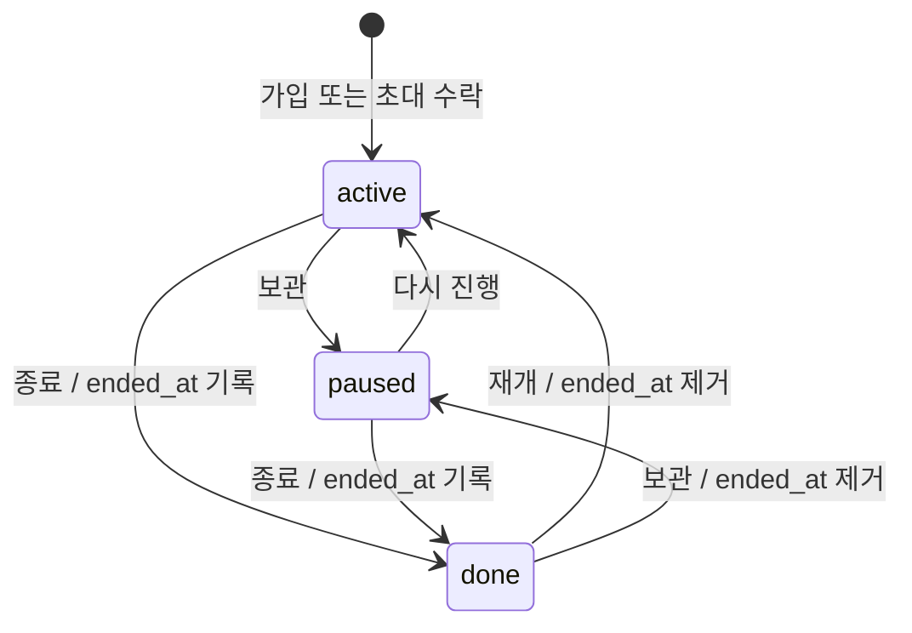
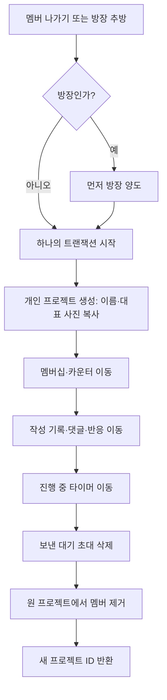

# 기능 요구사항 분석

출처: 「뜨개로그 백엔드 기능정의서」 14쪽. 본문과 PDF 7, 9, 10쪽의 표·관계도를 확인했습니다. PDF를 기준으로 합니다. 앱 코드와 충돌하면 PDF를 따릅니다.

**확정**은 PDF에 동작이 명시된 상태입니다. **충돌**은 규칙 간 상호작용이 불명확한 상태입니다. **미정**은 기획 결정을 보류한 상태입니다. **선택**은 선택 또는 권장 사항입니다. ID는 기능 추적 단위이며 별도 엔드포인트를 뜻하지 않습니다.

## 공통 규칙

- 상태·실·바늘·카운터·타이머·기록은 멤버 개인 소유입니다.
- 상태는 active, paused, done입니다. done 진입 시 ended_at을 기록합니다. 다른 상태로 바꾸면 ended_at을 지웁니다.
- 같은 프로젝트 멤버는 프로필 공개 범위와 무관하게 프로젝트의 진행상황과 기록을 봅니다.
- 이관 때 작성자가 아닌 사람의 댓글·반응도 기록과 함께 보존합니다.
- 차단은 양방향 숨김입니다. 검색·프로필·게시글·댓글·프로젝트 기록을 숨깁니다.
- 프로필 기록·총 시간은 공개 범위로 제한합니다. 피드 게시글은 공개 범위와 무관하게 노출합니다.

## 기능별 추적표

| ID | 원문 쪽 | 행위자 | 선행 조건 | 입력 | 성공 기준 | 거부 조건 | 수용 기준 | 상태 |
|---|---:|---|---|---|---|---|---|---|

## 상태 전이

PDF는 done 상태에서 새 기록·타이머·카운터 입력을 막습니다. done 상태에서 기존 기록을 수정·삭제할 수 있는지는 정하지 않았습니다.

## 나가기·추방 이관

## 정책 분석

- **멤버십 개인 소유**: 프로젝트는 공유 공간입니다. 상태·실·바늘·카운터·타이머·작성 기록은 멤버에 귀속됩니다.
- **done 상태**: 기록 생성·타이머·카운터 입력은 금지됩니다. 기존 기록 변경·삭제 정책은 미정입니다.
- **이관 트랜잭션**: PDF는 이관 전체를 한 트랜잭션으로 규정합니다. 다른 작성자의 댓글·반응은 원 기록에 붙인 채 보존합니다.
- **양방향 차단**: 각 방향의 차단 기록이 있어도 사용자 간 노출은 양쪽에서 막아야 합니다. 차단 시 친구·요청·초대를 제거하고 같은 프로젝트 멤버십은 유지합니다.
- **공개 범위와 공동 프로젝트**: 프로필 기록 조회는 public/friends/private 정책을 적용합니다. 같은 프로젝트의 기록 조회는 별도 권한입니다. 게시글 공개는 프로필 공개 범위와 무관합니다.
- **충돌 보류**: “차단이면 항상 거부”와 같은 프로젝트 멤버십 유지·프로젝트 내부 기록 조회 규칙이 함께 있습니다. 정확한 예외 범위를 결정하지 않습니다.
- PDF의 17개 모델 제안에는 약관 동의와 세션 저장 요구가 충분히 반영되지 않았습니다. 최종 ERD로 확정하지 않습니다.
| V1-101 | 2 | 가입 사용자 | 인증 불필요 | 화면 값 및 대상 ID | 고유한 로그인 ID 생성; 응답에서 타인에게 노출하지 않음 | 인증 부족, 대상 부재, 권한 부족 또는 차단 관계 | 로그인 아이디 가입 결과·권한·거부 동작 검증 | 확정 |
| V1-102 | 2 | 가입 사용자 | 인증 불필요 | 화면 값 및 대상 ID | 고유 handle 생성; 변경 가능 | 인증 부족, 대상 부재, 권한 부족 또는 차단 관계 | 계정 ID 가입 결과·권한·거부 동작 검증 | 확정 |
| V1-103 | 2 | 가입 사용자 | 인증 불필요 | 화면 값 및 대상 ID | 계정 생성 후 로그인 토큰 발급 | 인증 부족, 대상 부재, 권한 부족 또는 차단 관계 | 닉네임·비밀번호 가입 결과·권한·거부 동작 검증 | 확정 |
| V1-104 | 2 | 가입 사용자 | 인증 불필요 | 화면 값 및 대상 ID | 동의 시각과 약관 버전 저장 | 인증 부족, 대상 부재, 권한 부족 또는 차단 관계 | 약관 동의 저장 결과·권한·거부 동작 검증 | 확정 |
| V1-105 | 2 | 로그인 사용자 | 인증 불필요 | 화면 값 및 대상 ID | 일치 여부를 노출하지 않고 토큰 발급 | 인증 부족, 대상 부재, 권한 부족 또는 차단 관계 | 로그인 결과·권한·거부 동작 검증 | 확정 |
| V1-106 | 2 | 로그인 사용자 | 계정 또는 세션 존재 | 화면 값 및 대상 ID | 토큰 갱신 | 인증 부족, 대상 부재, 권한 부족 또는 차단 관계 | 토큰 갱신 결과·권한·거부 동작 검증 | 확정 |
| V1-107 | 2 | 가입 사용자 | 이메일·전화번호 미수집 | 화면 값 및 대상 ID | 비밀번호 초기화 방법은 정해지지 않음 | 현재 복구 수단 없음 | 비밀번호 찾기 결과·권한·거부 동작 검증 | 미정 |
| V1-108 | 2 | 가입 사용자 | 인증 불필요 | 화면 값 및 대상 ID | 로그인 없이 정책 문서 조회 | — | 정책 문서 조회 결과·권한·거부 동작 검증 | 확정 |
| V1-109 | 2 | 로그인 사용자 | 계정 또는 세션 존재 | 화면 값 및 대상 ID | 로그아웃 | 인증 부족, 대상 부재, 권한 부족 또는 차단 관계 | 로그아웃 결과·권한·거부 동작 검증 | 확정 |
| V1-110 | 2 | 로그인 사용자 | 계정 또는 세션 존재 | 화면 값 및 대상 ID | 회원 탈퇴 | 인증 부족, 대상 부재, 권한 부족 또는 차단 관계 | 회원 탈퇴 결과·권한·거부 동작 검증 | 확정 |
| V1-201 | 2 | 로그인 사용자 | 유효한 인증 | 화면 값 및 대상 ID | public/friends/private 설정, 기본 public | 인증 부족, 대상 부재, 권한 부족 또는 차단 관계 | 공개 범위 변경 결과·권한·거부 동작 검증 | 확정 |
| V1-202 | 2 | 로그인 사용자 | 유효한 인증 | 화면 값 및 대상 ID | 계정 ID 변경 | 인증 부족, 대상 부재, 권한 부족 또는 차단 관계 | 계정 ID 변경 결과·권한·거부 동작 검증 | 확정 |
| V1-203 | 2 | 로그인 사용자 | 유효한 인증 | 화면 값 및 대상 ID | 소개 변경 | 인증 부족, 대상 부재, 권한 부족 또는 차단 관계 | 소개 변경 결과·권한·거부 동작 검증 | 확정 |
| V1-204 | 2 | 로그인 사용자 | 유효한 인증 | 화면 값 및 대상 ID | 내 통계 조회 | 인증 부족, 대상 부재, 권한 부족 또는 차단 관계 | 내 통계 조회 결과·권한·거부 동작 검증 | 확정 |
| V1-205 | 2 | 로그인 사용자 | 유효한 인증 | 화면 값 및 대상 ID | 내 기록 모아보기 | 인증 부족, 대상 부재, 권한 부족 또는 차단 관계 | 내 기록 모아보기 결과·권한·거부 동작 검증 | 확정 |
| V1-206 | 2 | 로그인 사용자 | 유효한 인증 | 화면 값 및 대상 ID | 프로필 기본 정보 조회 | 인증 부족, 대상 부재, 권한 부족 또는 차단 관계 | 프로필 기본 정보 조회 결과·권한·거부 동작 검증 | 확정 |
| V1-207 | 2 | 로그인 사용자 | 유효한 인증 | 화면 값 및 대상 ID | 허용될 때만 목록·집계 노출 | 인증 부족, 대상 부재, 권한 부족 또는 차단 관계 | 프로필 기록 조회 결과·권한·거부 동작 검증 | 충돌 검토 |
| V1-208 | 2 | 로그인 사용자 | 유효한 인증 | 화면 값 및 대상 ID | 게시글은 공개 범위와 무관하게 노출 | 인증 부족, 대상 부재, 권한 부족 또는 차단 관계 | 프로필 게시글 조회 결과·권한·거부 동작 검증 | 충돌 검토 |
| V1-209 | 2 | 로그인 사용자 | 유효한 인증 | 화면 값 및 대상 ID | 프로필 메뉴 | 인증 부족, 대상 부재, 권한 부족 또는 차단 관계 | 프로필 메뉴 결과·권한·거부 동작 검증 | 확정 |
| V1-301 | 3 | 로그인 사용자 | 로그인; 차단 관계 제외 | 화면 값 및 대상 ID | 사용자 검색 | 인증 부족, 대상 부재, 권한 부족 또는 차단 관계 | 사용자 검색 결과·권한·거부 동작 검증 | 확정 |
| V1-302 | 3 | 로그인 사용자 | 로그인; 차단 관계 제외 | 화면 값 및 대상 ID | 상대의 대기 요청이 있으면 친구로 전환 | 인증 부족, 대상 부재, 권한 부족 또는 차단 관계 | 친구 요청 전송 결과·권한·거부 동작 검증 | 확정 |
| V1-303 | 3 | 로그인 사용자 | 로그인; 차단 관계 제외 | 화면 값 및 대상 ID | 요청 수락·거절 | 인증 부족, 대상 부재, 권한 부족 또는 차단 관계 | 요청 수락·거절 결과·권한·거부 동작 검증 | 확정 |
| V1-304 | 3 | 로그인 사용자 | 로그인; 차단 관계 제외 | 화면 값 및 대상 ID | 보낸 요청 취소 | 인증 부족, 대상 부재, 권한 부족 또는 차단 관계 | 보낸 요청 취소 결과·권한·거부 동작 검증 | 확정 |
| V1-305 | 3 | 로그인 사용자 | 로그인; 차단 관계 제외 | 화면 값 및 대상 ID | 친구 목록·해제 | 인증 부족, 대상 부재, 권한 부족 또는 차단 관계 | 친구 목록·해제 결과·권한·거부 동작 검증 | 확정 |
| V1-306 | 3 | 로그인 사용자 | 로그인; 차단 관계 제외 | 화면 값 및 대상 ID | 요청 배지 | 인증 부족, 대상 부재, 권한 부족 또는 차단 관계 | 요청 배지 결과·권한·거부 동작 검증 | 확정 |
| V1-401 | 4 | 로그인 사용자 | 프로젝트 멤버; 방장 전용 작업은 방장 권한 | 화면 값 및 대상 ID | 방장 1명인 비공개 프로젝트 생성 | 인증 부족, 대상 부재, 권한 부족 또는 차단 관계 | 프로젝트 생성 결과·권한·거부 동작 검증 | 확정 |
| V1-402 | 4 | 로그인 사용자 | 프로젝트 멤버; 방장 전용 작업은 방장 권한 | 화면 값 및 대상 ID | 개인 멤버십과 기본 카운터 2개 생성 | 인증 부족, 대상 부재, 권한 부족 또는 차단 관계 | 내 멤버십 생성 결과·권한·거부 동작 검증 | 확정 |
| V1-403 | 4 | 로그인 사용자 | 프로젝트 멤버; 방장 전용 작업은 방장 권한 | 화면 값 및 대상 ID | 프로젝트 생성과 초대를 한 트랜잭션으로 처리 | 인증 부족, 대상 부재, 권한 부족 또는 차단 관계 | 생성과 함께 친구 초대 결과·권한·거부 동작 검증 | 확정 |
| V1-404 | 4 | 로그인 사용자 | 프로젝트 멤버; 방장 전용 작업은 방장 권한 | 화면 값 및 대상 ID | 프로젝트 목록 조회 | 인증 부족, 대상 부재, 권한 부족 또는 차단 관계 | 프로젝트 목록 조회 결과·권한·거부 동작 검증 | 확정 |
| V1-405 | 4 | 로그인 사용자 | 프로젝트 멤버; 방장 전용 작업은 방장 권한 | 화면 값 및 대상 ID | 상태 정렬·필터 | 인증 부족, 대상 부재, 권한 부족 또는 차단 관계 | 상태 정렬·필터 결과·권한·거부 동작 검증 | 확정 |
| V1-406 | 4 | 로그인 사용자 | 프로젝트 멤버; 방장 전용 작업은 방장 권한 | 화면 값 및 대상 ID | 멤버 진행상황 조회 | 인증 부족, 대상 부재, 권한 부족 또는 차단 관계 | 멤버 진행상황 조회 결과·권한·거부 동작 검증 | 충돌 검토 |
| V1-407 | 4 | 로그인 사용자 | 프로젝트 멤버; 방장 전용 작업은 방장 권한 | 화면 값 및 대상 ID | 프로젝트·내 멤버십 수정 | 인증 부족, 대상 부재, 권한 부족 또는 차단 관계 | 프로젝트·내 멤버십 수정 결과·권한·거부 동작 검증 | 확정 |
| V1-408 | 4 | 로그인 사용자 | 프로젝트 멤버; 방장 전용 작업은 방장 권한 | 화면 값 및 대상 ID | done 진입 때 ended_at 설정, 그 외에는 제거 | 인증 부족, 대상 부재, 권한 부족 또는 차단 관계 | 멤버 상태 전환 결과·권한·거부 동작 검증 | 확정 |
| V1-409 | 4 | 로그인 사용자 | 프로젝트 멤버; 방장 전용 작업은 방장 권한 | 화면 값 및 대상 ID | 프로젝트 삭제 | 인증 부족, 대상 부재, 권한 부족 또는 차단 관계 | 프로젝트 삭제 결과·권한·거부 동작 검증 | 확정 |
| V1-501 | 4 | 로그인 사용자 | 프로젝트 멤버; 방장 전용 작업은 방장 권한 | 화면 값 및 대상 ID | 친구 초대 | 인증 부족, 대상 부재, 권한 부족 또는 차단 관계 | 친구 초대 결과·권한·거부 동작 검증 | 확정 |
| V1-502 | 4 | 로그인 사용자 | 프로젝트 멤버; 방장 전용 작업은 방장 권한 | 화면 값 및 대상 ID | 초대 취소 | 인증 부족, 대상 부재, 권한 부족 또는 차단 관계 | 초대 취소 결과·권한·거부 동작 검증 | 확정 |
| V1-503 | 4 | 로그인 사용자 | 프로젝트 멤버; 방장 전용 작업은 방장 권한 | 화면 값 및 대상 ID | 받은 초대 목록 | 인증 부족, 대상 부재, 권한 부족 또는 차단 관계 | 받은 초대 목록 결과·권한·거부 동작 검증 | 확정 |
| V1-504 | 4 | 로그인 사용자 | 프로젝트 멤버; 방장 전용 작업은 방장 권한 | 화면 값 및 대상 ID | 수락 시 active 멤버십 및 기본 카운터 생성 | 인증 부족, 대상 부재, 권한 부족 또는 차단 관계 | 초대 수락·거절 결과·권한·거부 동작 검증 | 확정 |
| V1-505 | 4 | 로그인 사용자 | 프로젝트 멤버; 방장 전용 작업은 방장 권한 | 화면 값 및 대상 ID | 새 방장 지정, 이전 방장은 일반 멤버 | 인증 부족, 대상 부재, 권한 부족 또는 차단 관계 | 방장 양도 결과·권한·거부 동작 검증 | 확정 |
| V1-506 | 4 | 로그인 사용자 | 프로젝트 멤버; 방장 전용 작업은 방장 권한 | 화면 값 및 대상 ID | 기록·타이머 등 떠난 멤버 데이터를 개인 프로젝트로 이관; 동일 트랜잭션에서 멤버십·카운터·타이머·작성 기록 이동, 댓글·반응 보존 | 인증 부족, 대상 부재, 권한 부족 또는 차단 관계 | 멤버 추방 결과·권한·거부 동작 검증 | 확정 |
| V1-507 | 4 | 로그인 사용자 | 프로젝트 멤버; 방장 전용 작업은 방장 권한 | 화면 값 및 대상 ID | 이관 후 새 프로젝트 ID 반환; 동일 트랜잭션에서 멤버십·카운터·타이머·작성 기록 이동, 댓글·반응 보존 | 인증 부족, 대상 부재, 권한 부족 또는 차단 관계 | 프로젝트 나가기 결과·권한·거부 동작 검증 | 확정 |
| V1-508 | 4 | 로그인 사용자 | 프로젝트 멤버; 방장 전용 작업은 방장 권한 | 화면 값 및 대상 ID | 멤버 보기·프로필 이동 | 인증 부족, 대상 부재, 권한 부족 또는 차단 관계 | 멤버 보기·프로필 이동 결과·권한·거부 동작 검증 | 확정 |
| V1-601 | 5 | 로그인 사용자 | 프로젝트 멤버; done 상태가 아님 | 화면 값 및 대상 ID | 타이머 기록 작성 | 인증 부족, 대상 부재, 권한 부족 또는 차단 관계 | 타이머 기록 작성 결과·권한·거부 동작 검증 | 확정 |
| V1-602 | 5 | 로그인 사용자 | 프로젝트 멤버; done 상태가 아님 | 화면 값 및 대상 ID | 직접 기록 추가 | 인증 부족, 대상 부재, 권한 부족 또는 차단 관계 | 직접 기록 추가 결과·권한·거부 동작 검증 | 확정 |
| V1-603 | 5 | 로그인 사용자 | 프로젝트 멤버; done 상태가 아님 | 화면 값 및 대상 ID | 기록 본문 작성 | 인증 부족, 대상 부재, 권한 부족 또는 차단 관계 | 기록 본문 작성 결과·권한·거부 동작 검증 | 확정 |
| V1-604 | 5 | 로그인 사용자 | 프로젝트 멤버; done 상태가 아님 | 화면 값 및 대상 ID | 작성자만 자신의 기록 수정·삭제 | 인증 부족, 대상 부재, 권한 부족 또는 차단 관계 | 기록 수정·삭제 결과·권한·거부 동작 검증 | 확정 |
| V1-605 | 5 | 로그인 사용자 | 프로젝트 멤버; done 상태가 아님 | 화면 값 및 대상 ID | 멤버 기록 조회 | 인증 부족, 대상 부재, 권한 부족 또는 차단 관계 | 멤버 기록 조회 결과·권한·거부 동작 검증 | 충돌 검토 |
| V1-606 | 5 | 로그인 사용자 | 프로젝트 멤버; done 상태가 아님 | 화면 값 및 대상 ID | 허용된 이모지 반응 추가·취소 | 인증 부족, 대상 부재, 권한 부족 또는 차단 관계 | 기록 반응 결과·권한·거부 동작 검증 | 확정 |
| V1-607 | 5 | 로그인 사용자 | 프로젝트 멤버; done 상태가 아님 | 화면 값 및 대상 ID | 작성자 댓글 삭제; 차단 관계 댓글 숨김 | 인증 부족, 대상 부재, 권한 부족 또는 차단 관계 | 기록 댓글 결과·권한·거부 동작 검증 | 충돌 검토 |
| V1-701 | 6 | 로그인 사용자 | 프로젝트 멤버; done 상태가 아님 | 화면 값 및 대상 ID | 서버 저장 여부는 미정; 시작 시각 기준 계산 | 인증 부족, 대상 부재, 권한 부족 또는 차단 관계 | 타이머 시작·일시정지 결과·권한·거부 동작 검증 | 미정 |
| V1-702 | 6 | 로그인 사용자 | 프로젝트 멤버; done 상태가 아님 | 화면 값 및 대상 ID | 타이머 종료 | 인증 부족, 대상 부재, 권한 부족 또는 차단 관계 | 타이머 종료 결과·권한·거부 동작 검증 | 확정 |
| V1-703 | 6 | 로그인 사용자 | 프로젝트 멤버; done 상태가 아님 | 화면 값 및 대상 ID | 0 미만 불가; 목표 초과 허용 | 인증 부족, 대상 부재, 권한 부족 또는 차단 관계 | 카운터 ±1 결과·권한·거부 동작 검증 | 확정 |
| V1-704 | 6 | 로그인 사용자 | 프로젝트 멤버; done 상태가 아님 | 화면 값 및 대상 ID | 카운터 추가·삭제 | 인증 부족, 대상 부재, 권한 부족 또는 차단 관계 | 카운터 추가·삭제 결과·권한·거부 동작 검증 | 선택 |
| V1-705 | 6 | 로그인 사용자 | 프로젝트 멤버; done 상태가 아님 | 화면 값 및 대상 ID | 카운터 수정 | 인증 부족, 대상 부재, 권한 부족 또는 차단 관계 | 카운터 수정 결과·권한·거부 동작 검증 | 확정 |
| V1-706 | 6 | 로그인 사용자 | 프로젝트 멤버; done 상태가 아님 | 화면 값 및 대상 ID | 카운터 표시·순서 | 인증 부족, 대상 부재, 권한 부족 또는 차단 관계 | 카운터 표시·순서 결과·권한·거부 동작 검증 | 선택 |
| V1-707 | 6 | 로그인 사용자 | 프로젝트 멤버; done 상태가 아님 | 화면 값 및 대상 ID | 카운터 초기화 | 인증 부족, 대상 부재, 권한 부족 또는 차단 관계 | 카운터 초기화 결과·권한·거부 동작 검증 | 확정 |
| V1-801 | 6 | 로그인 사용자 | 인증; 대상 게시글 또는 사용자 접근 가능 | 화면 값 및 대상 ID | 최신순·커서 페이지·차단 관계 제외 | 인증 부족, 대상 부재, 권한 부족 또는 차단 관계 | 피드 조회 결과·권한·거부 동작 검증 | 선택 |
| V1-802 | 6 | 로그인 사용자 | 인증; 대상 게시글 또는 사용자 접근 가능 | 화면 값 및 대상 ID | 게시글 작성 | 인증 부족, 대상 부재, 권한 부족 또는 차단 관계 | 게시글 작성 결과·권한·거부 동작 검증 | 선택 |
| V1-803 | 6 | 로그인 사용자 | 인증; 대상 게시글 또는 사용자 접근 가능 | 화면 값 및 대상 ID | 작성자만 게시글 삭제 | 인증 부족, 대상 부재, 권한 부족 또는 차단 관계 | 게시글 삭제 결과·권한·거부 동작 검증 | 확정 |
| V1-804 | 6 | 로그인 사용자 | 인증; 대상 게시글 또는 사용자 접근 가능 | 화면 값 및 대상 ID | 좋아요 전환 | 인증 부족, 대상 부재, 권한 부족 또는 차단 관계 | 좋아요 전환 결과·권한·거부 동작 검증 | 확정 |
| V1-805 | 6 | 로그인 사용자 | 인증; 대상 게시글 또는 사용자 접근 가능 | 화면 값 및 대상 ID | 게시글 댓글 | 인증 부족, 대상 부재, 권한 부족 또는 차단 관계 | 게시글 댓글 결과·권한·거부 동작 검증 | 확정 |
| V1-901 | 6 | 로그인 사용자 | 인증; 대상 게시글 또는 사용자 접근 가능 | 화면 값 및 대상 ID | 사유·상세 저장; 선택 시 차단도 수행 | 인증 부족, 대상 부재, 권한 부족 또는 차단 관계 | 신고 결과·권한·거부 동작 검증 | 확정 |
| V1-902 | 6 | 로그인 사용자 | 인증; 대상 게시글 또는 사용자 접근 가능 | 화면 값 및 대상 ID | 차단을 저장하고 친구 관계·요청·초대를 제거 | 차단 관계이면 새 요청·초대 거부 | 차단 결과·권한·거부 동작 검증 | 충돌 검토 |
| V1-903 | 6 | 로그인 사용자 | 인증; 대상 게시글 또는 사용자 접근 가능 | 화면 값 및 대상 ID | 차단 목록·해제 | 인증 부족, 대상 부재, 권한 부족 또는 차단 관계 | 차단 목록·해제 결과·권한·거부 동작 검증 | 확정 |
