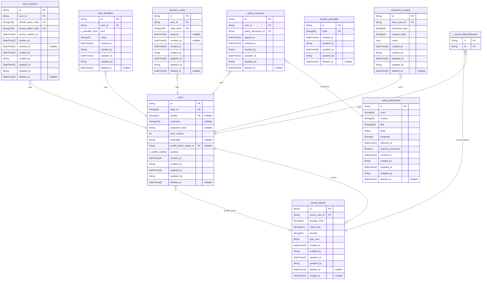
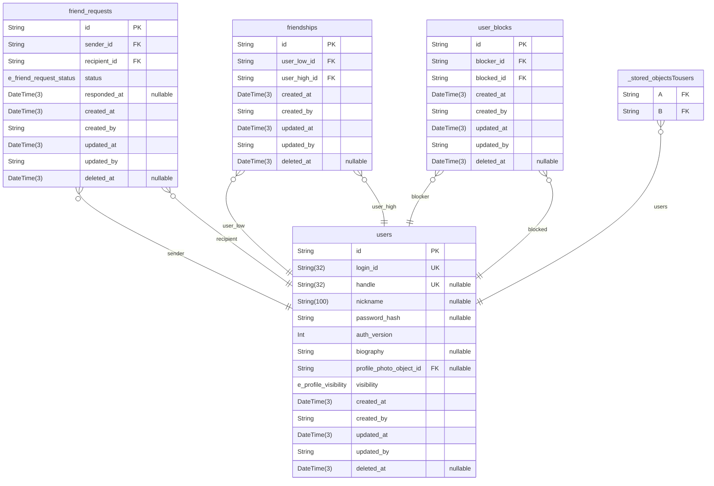
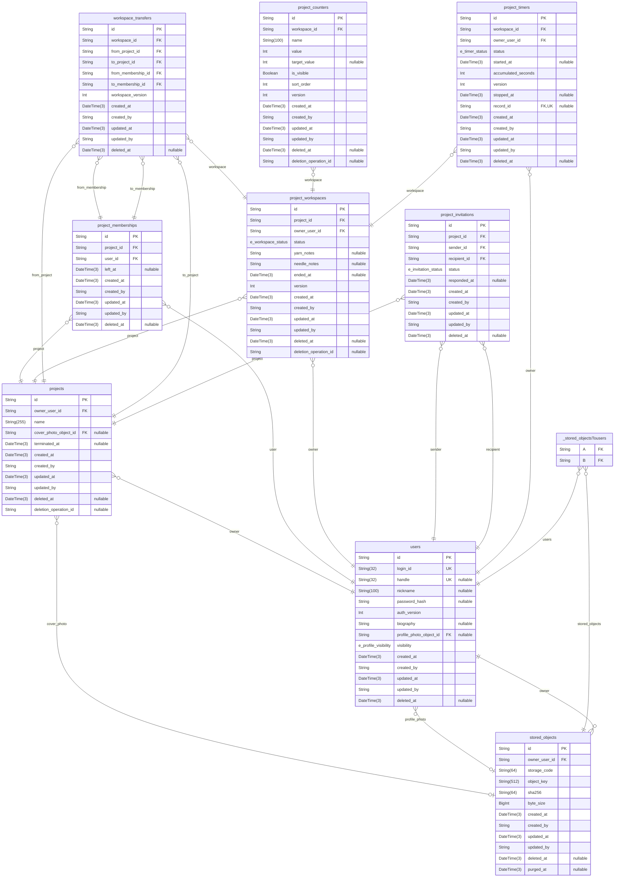
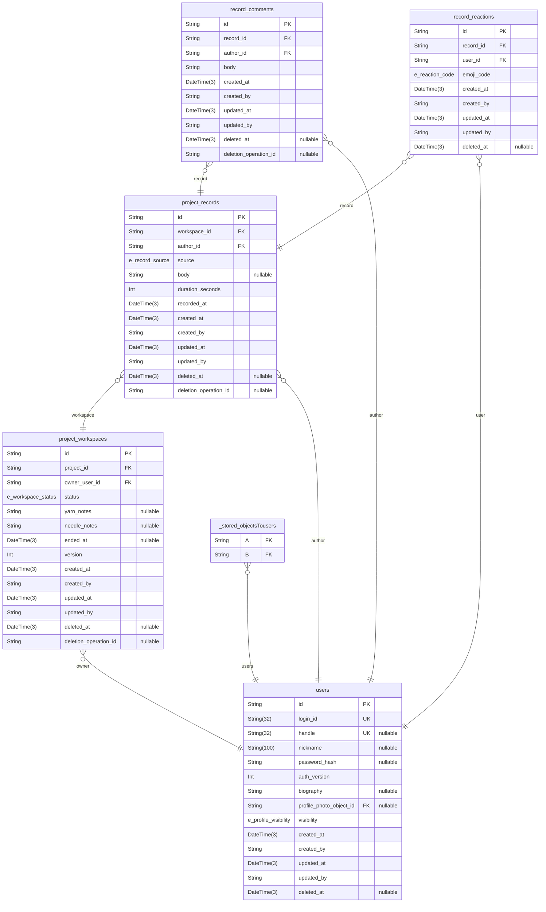
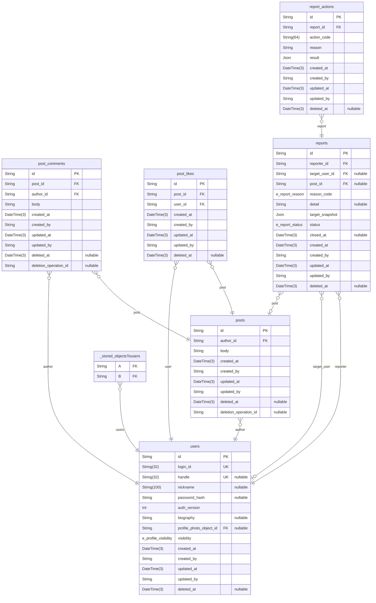
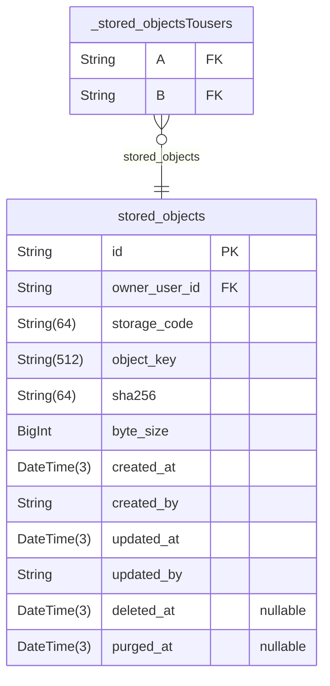

# 뜨개로그 ERD - 논리 관계, 물리 FK 없음

> Generated by [`prisma-markdown`](https://github.com/samchon/prisma-markdown)

- [계정](#계정)
- [친구와차단](#친구와차단)
- [프로젝트](#프로젝트)
- [기록](#기록)
- [커뮤니티](#커뮤니티)
- [파일](#파일)

## 계정

### `users`

서비스 계정입니다. 로그인 ID와 공개 계정 ID를 분리합니다.
비밀번호는 해시만 저장합니다. 탈퇴 시 공개 프로필과 인증 비밀값을 제거합니다.

Properties as follows:

- `id`: 사용자 식별자입니다. 가입 시 비즈니스 계층에서 감사 주체도 지정합니다.
- `login_id`: 로그인에만 사용하는 값입니다. 다른 사용자에게 공개하지 않습니다.
- `handle`: 현재 공개 계정 ID입니다. 탈퇴 시 제거하며 과거 값은 식별자 예약에 보존합니다.
- `nickname`: 사용자에게 표시하는 이름입니다. 탈퇴 후에는 저장값 대신 탈퇴한 사용자를 표시합니다.
- `password_hash`: 검증용 비밀번호 해시입니다. 원본 비밀번호는 저장하지 않습니다.
- `auth_version`: 접근 토큰의 유효성 번호입니다. 비밀번호 재설정과 탈퇴 시 증가시킵니다.
- `biography`: 사용자가 작성한 소개입니다.
- `profile_photo_object_id`: 프로필 사진의 저장 객체 식별자입니다. 표시 주소는 조회 시 생성합니다.
- `visibility`: 프로필 기록과 총 작업 시간의 공개 범위입니다.
- `created_at`: 행을 생성한 시각입니다.
- `created_by`: 서버가 확인한 생성 주체의 식별자입니다.
- `updated_at`: 행을 최근 변경한 시각입니다.
- `updated_by`: 서버가 확인한 최근 변경 주체의 식별자입니다.
- `deleted_at`: 논리삭제 시각입니다. 삭제되지 않았으면 NULL입니다.

### `auth_sessions`

갱신과 로그아웃에 사용하는 세션입니다. 원본 갱신 토큰은 저장하지 않습니다.
만료·폐기 검사와 갱신 충돌 처리는 비즈니스 계층의 책임입니다.
과거 DB 복원 후 기존 세션을 무효화합니다. 콘텐츠 복구로 세션을 재활성화하지 않습니다.

Properties as follows:

- `id`: 행의 UUID 식별자입니다.
- `user_id`: 관련 사용자의 논리 참조 식별자입니다.
- `refresh_token_hash`: 갱신 토큰의 해시입니다. 원본 토큰은 저장하지 않습니다.
- `access_token_hash`: 불투명 접근 토큰의 해시입니다. 매 요청에서 현재 세션 상태를 확인합니다.
- `access_expires_at`: 접근 토큰의 만료 시각입니다. 갱신 세션의 만료와 구분합니다.
- `expires_at`: 세션의 만료 시각입니다.
- `revoked_at`: 세션을 폐기한 시각입니다.
- `created_at`: 행을 생성한 시각입니다.
- `created_by`: 서버가 확인한 생성 주체의 식별자입니다.
- `updated_at`: 행을 최근 변경한 시각입니다.
- `updated_by`: 서버가 확인한 최근 변경 주체의 식별자입니다.
- `deleted_at`: 논리삭제 시각입니다. 삭제되지 않았으면 NULL입니다.

### `policy_documents`

한국어 정책 문서입니다. 효력 시작 시각이 지난 최신 버전을 선택합니다.
동의가 참조하는 버전의 본문은 수정하지 않습니다.
정책 변경은 새 버전을 생성합니다. 공통 감사 컬럼은 본문 변경 허용을 뜻하지 않습니다.

Properties as follows:

- `id`: 행의 UUID 식별자입니다.
- `code`: 정책 문서 종류의 ASCII 코드입니다.
- `version`: 동의 대상 문서의 버전 코드입니다.
- `title`: 문서 제목입니다.
- `body`: 콘텐츠 본문입니다.
- `language`: 초기 정책 문서의 언어 코드입니다.
- `effective_at`: 이 버전의 효력이 시작하는 시각입니다.
- `requires_reconsent`: 새 버전의 업무 변경 전에 사용자 재동의를 요구하는지 표시합니다.
- `created_at`: 행을 생성한 시각입니다.
- `created_by`: 서버가 확인한 생성 주체의 식별자입니다.
- `updated_at`: 행을 최근 변경한 시각입니다.
- `updated_by`: 서버가 확인한 최근 변경 주체의 식별자입니다.
- `deleted_at`: 논리삭제 시각입니다. 삭제되지 않았으면 NULL입니다.

### `policy_consents`

사용자가 동의한 정책 버전과 시각입니다. 버전은 정책 문서를 통해 식별합니다.

Properties as follows:

- `id`: 행의 UUID 식별자입니다.
- `user_id`: 관련 사용자의 논리 참조 식별자입니다.
- `policy_document_id`: 동의한 정책 버전의 논리 참조 식별자입니다.
- `agreed_at`: 사용자가 정책에 동의한 시각입니다.
- `created_at`: 행을 생성한 시각입니다.
- `created_by`: 서버가 확인한 생성 주체의 식별자입니다.
- `updated_at`: 행을 최근 변경한 시각입니다.
- `updated_by`: 서버가 확인한 최근 변경 주체의 식별자입니다.
- `deleted_at`: 논리삭제 시각입니다. 삭제되지 않았으면 NULL입니다.

### `user_identifiers`

과거 로그인 ID와 handle의 영구 예약입니다. 같은 계정의 handle 복귀만 허용합니다.
탈퇴 뒤에도 예약과 원래 사용자 식별자를 보존합니다. 이 행의 논리삭제로 재발급하지 않습니다.

Properties as follows:

- `id`: 예약 행의 UUID 식별자입니다.
- `user_id`: 이 값을 처음 사용한 사용자 식별자입니다.
- `kind`: 로그인 ID 또는 handle 예약인지 구분합니다.
- `value`: 공백 제거와 영문 소문자 정규화를 완료한 식별자입니다.
- `created_at`: 예약을 생성한 시각입니다.
- `created_by`: 서버가 확인한 생성 주체입니다.
- `updated_at`: 예약 메타데이터를 최근 변경한 시각입니다.
- `updated_by`: 서버가 확인한 최근 변경 주체입니다.
- `deleted_at`: 예약의 보존 표시입니다. 값의 고유성에는 영향을 주지 않습니다.

### `recovery_codes`

일회용 계정 복구 코드입니다. 원문은 발급 응답에서 한 번 제공하며 저장하지 않습니다.
사용과 재발급은 사용자 잠금 아래에서 이전 코드를 무효화합니다.

Properties as follows:

- `id`: 코드 발급 행의 UUID 식별자입니다.
- `user_id`: 복구 대상 사용자 식별자입니다.
- `code_hash`: 복구 코드 검증용 해시입니다. 원문은 저장하지 않습니다.
- `used_at`: 코드를 사용한 시각입니다. 사용한 코드는 다시 사용하지 않습니다.
- `revoked_at`: 재발급 또는 탈퇴로 무효화한 시각입니다.
- `created_at`: 발급 행을 생성한 시각입니다.
- `created_by`: 서버가 확인한 생성 주체입니다.
- `updated_at`: 행을 최근 변경한 시각입니다.
- `updated_by`: 서버가 확인한 최근 변경 주체입니다.
- `deleted_at`: 논리삭제 시각입니다. 삭제된 코드는 유효하지 않습니다.

### `system_principals`

사용자 로그인 계정과 분리한 시스템 감사 주체입니다. 작업 종류마다 고정 UUID를 등록합니다.
감사 컬럼의 값은 서버가 선택합니다. 클라이언트가 주체를 지정하지 않습니다.

Properties as follows:

- `id`: 승인한 작업 종류의 고정 UUID입니다. 자동 생성하지 않습니다.
- `code`: 시스템 작업 종류의 ASCII 코드입니다.
- `created_at`: 등록한 시각입니다.
- `created_by`: 서버가 확인한 등록 주체입니다.
- `updated_at`: 등록 정보를 최근 변경한 시각입니다.
- `updated_by`: 서버가 확인한 최근 변경 주체입니다.
- `deleted_at`: 신규 작업 사용을 금지한 시각입니다. 과거 감사 식별자는 보존합니다.

### `command_receipts`

트랜잭션을 완료한 명령의 재시도 결과입니다. 업무 변경과 같은 트랜잭션에 저장합니다.
작업 식별자가 같고 입력 해시가 다르면 충돌로 거부합니다. 실패한 트랜잭션은 남기지 않습니다.

Properties as follows:

- `id`: 클라이언트가 재시도에도 유지하는 명령 UUID입니다. 자동 생성하지 않습니다.
- `actor_user_id`: 인증으로 확인한 실행 사용자입니다. 재시도는 같은 사용자만 허용합니다.
- `command_type`: 명령 종류의 서버 코드입니다.
- `request_hash`: 정규화한 입력 계약의 소문자 SHA-256 값입니다.
- `result`: 재시도에서 반환할 비밀값이 없는 완료 결과입니다.
- `created_at`: 명령을 완료한 시각입니다.
- `created_by`: 서버가 확인한 생성 주체입니다.
- `updated_at`: 완료 시각과 같은 값입니다. 완료 결과는 덮어쓰지 않습니다.
- `updated_by`: 서버가 확인한 최근 변경 주체입니다.
- `deleted_at`: 보존 표시입니다. 같은 작업 식별자를 재사용하지 않습니다.

### `_stored_objectsTousers`

Pair relationship table between [stored_objects](#stored_objects) and [users](#users)

Properties as follows:

- `A`:
- `B`:

## 친구와차단

### `friend_requests`

방향이 있는 친구 요청입니다. 처리한 요청은 새 요청과 구분해 보존할 수 있습니다.
양방향 대기 요청의 중복은 design-constraints.sql의 부분 고유 인덱스로 제한합니다.
반대 방향의 대기 요청이 있으면 요청 처리와 친구 생성을 함께 수행합니다.

Properties as follows:

- `id`: 행의 UUID 식별자입니다.
- `sender_id`: 요청 또는 초대를 보낸 사용자의 식별자입니다.
- `recipient_id`: 요청 또는 초대를 받은 사용자의 식별자입니다.
- `status`: 해당 행의 업무 처리 상태입니다.
- `responded_at`: 요청 또는 초대를 처리한 시각입니다.
- `created_at`: 행을 생성한 시각입니다.
- `created_by`: 서버가 확인한 생성 주체의 식별자입니다.
- `updated_at`: 행을 최근 변경한 시각입니다.
- `updated_by`: 서버가 확인한 최근 변경 주체의 식별자입니다.
- `deleted_at`: 논리삭제 시각입니다. 삭제되지 않았으면 NULL입니다.

### `friendships`

상호 친구 관계입니다. 작은 사용자 ID와 큰 사용자 ID의 순서로 저장합니다.
자기 자신과의 관계와 역순 입력은 비즈니스 계층에서 거부합니다.
해제 후 재연결할 때 같은 관계 행을 재사용하는 것은 설계 제안입니다.

Properties as follows:

- `id`: 행의 UUID 식별자입니다.
- `user_low_id`: 정렬한 사용자 쌍에서 작은 식별자입니다.
- `user_high_id`: 정렬한 사용자 쌍에서 큰 식별자입니다.
- `created_at`: 행을 생성한 시각입니다.
- `created_by`: 서버가 확인한 생성 주체의 식별자입니다.
- `updated_at`: 행을 최근 변경한 시각입니다.
- `updated_by`: 서버가 확인한 최근 변경 주체의 식별자입니다.
- `deleted_at`: 논리삭제 시각입니다. 삭제되지 않았으면 NULL입니다.

### `user_blocks`

차단한 방향을 저장합니다. 노출 제한은 양쪽 방향을 검사합니다.
차단 해제 시 반대 방향의 차단까지 해제하지 않습니다.
기존 공동 프로젝트 멤버십은 삭제하지 않습니다.
콘텐츠 복구는 차단 상태를 변경하지 않습니다.

Properties as follows:

- `id`: 행의 UUID 식별자입니다.
- `blocker_id`: 차단을 실행한 사용자의 식별자입니다.
- `blocked_id`: 차단 대상 사용자의 식별자입니다.
- `created_at`: 행을 생성한 시각입니다.
- `created_by`: 서버가 확인한 생성 주체의 식별자입니다.
- `updated_at`: 행을 최근 변경한 시각입니다.
- `updated_by`: 서버가 확인한 최근 변경 주체의 식별자입니다.
- `deleted_at`: 논리삭제 시각입니다. 삭제되지 않았으면 NULL입니다.

## 프로젝트

### `projects`

비공개 공유 작업 공간입니다. 방장 정보의 기준은 owner_user_id 하나입니다.
비즈니스 계층은 방장이 유효한 멤버인지 검사합니다.
개인 이관 프로젝트도 같은 모델을 사용합니다.

Properties as follows:

- `id`: 행의 UUID 식별자입니다.
- `owner_user_id`: 현재 방장의 사용자 식별자입니다.
- `name`: 프로젝트 또는 카운터의 표시 이름입니다.
- `cover_photo_object_id`: 프로젝트 대표 사진의 저장 객체 식별자입니다. 이관 프로젝트도 같은 객체를 참조할 수 있습니다.
- `terminated_at`: 마지막 참여자가 나가 프로젝트를 종료한 시각입니다. 신규 참여와 쓰기를 금지합니다.
- `created_at`: 행을 생성한 시각입니다.
- `created_by`: 서버가 확인한 생성 주체의 식별자입니다.
- `updated_at`: 행을 최근 변경한 시각입니다.
- `updated_by`: 서버가 확인한 최근 변경 주체의 식별자입니다.
- `deleted_at`: 논리삭제 시각입니다. 삭제되지 않았으면 NULL입니다.
- `deletion_operation_id`: 이 행을 직접 삭제한 작업의 UUID입니다. 복구 시 삭제 시각과 함께 제거합니다.

### `project_memberships`

사용자의 프로젝트 참여 기간입니다. 개인 작업 데이터는 소유하지 않습니다.
참여 종료는 left_at을 기록합니다. 재가입은 새 행을 생성합니다.
유효한 참여는 left_at과 deleted_at이 모두 NULL인 행입니다.
같은 프로젝트와 사용자의 유효한 참여는 부분 고유 인덱스로 하나만 허용합니다.

Properties as follows:

- `id`: 행의 UUID 식별자입니다.
- `project_id`: 참여하거나 초대한 프로젝트의 논리 참조 식별자입니다.
- `user_id`: 관련 사용자의 논리 참조 식별자입니다.
- `left_at`: 참여를 종료한 시각입니다. 작업 완료나 콘텐츠 삭제와 구분합니다.
- `created_at`: 행을 생성한 시각입니다.
- `created_by`: 서버가 확인한 생성 주체의 식별자입니다.
- `updated_at`: 행을 최근 변경한 시각입니다.
- `updated_by`: 서버가 확인한 최근 변경 주체의 식별자입니다.
- `deleted_at`: 논리삭제 시각입니다. 삭제되지 않았으면 NULL입니다.

### `project_workspaces`

사용자가 소유한 개인 작업 공간입니다. 참여 권한은 멤버십으로 판정합니다.
작업 상태와 실·바늘 메모는 이 행에 귀속됩니다.
이관은 project_id를 변경합니다. 하위 데이터와 원 작성자의 식별자는 유지합니다.
모든 하위 데이터 변경은 이 행을 잠그고 version을 증가시킵니다.

Properties as follows:

- `id`: 행의 UUID 식별자입니다. 이관 후에도 유지합니다.
- `project_id`: 현재 작업 공간이 속한 프로젝트의 식별자입니다.
- `owner_user_id`: 개인 작업 공간을 소유한 사용자의 식별자입니다.
- `status`: 개인 작업의 상태입니다. 참여 종료 상태가 아닙니다.
- `yarn_notes`: 사용자가 사용하는 실의 텍스트 메모입니다. 초기 버전은 구조화하지 않습니다.
- `needle_notes`: 사용자가 사용하는 바늘의 텍스트 메모입니다. 초기 버전은 구조화하지 않습니다.
- `ended_at`: done 상태로 변경한 시각입니다. 다른 상태에서는 NULL입니다.
- `version`: 이관과 하위 데이터 변경을 포함한 작업 공간의 변경 번호입니다.
- `created_at`: 행을 생성한 시각입니다.
- `created_by`: 서버가 확인한 생성 주체의 식별자입니다.
- `updated_at`: 행을 최근 변경한 시각입니다.
- `updated_by`: 서버가 확인한 최근 변경 주체의 식별자입니다.
- `deleted_at`: 이 작업 공간을 직접 삭제한 시각입니다. 프로젝트 삭제로 변경하지 않습니다.
- `deletion_operation_id`: 이 행을 직접 삭제한 작업의 UUID입니다. 복구 시 삭제 시각과 함께 제거합니다.

### `workspace_transfers`

완료된 이관의 변경 전후 관계를 보존합니다. 생성 후 업무 필드를 변경하지 않습니다.
id는 이관 작업 식별자입니다. 재시도는 같은 id와 같은 입력을 사용합니다.
생성 시각과 생성 주체는 이관 완료 시각과 처리 주체입니다.
역이관은 새 이관 행을 생성합니다. 기존 이력을 덮어쓰지 않습니다.

Properties as follows:

- `id`: 이관 작업의 UUID입니다. 중복 처리와 요청 내용의 일치를 확인합니다.
- `workspace_id`: 이동한 개인 작업 공간의 식별자입니다.
- `from_project_id`: 이관 전 프로젝트의 식별자입니다.
- `to_project_id`: 이관 후 프로젝트의 식별자입니다.
- `from_membership_id`: 이관에서 종료한 참여 기간의 식별자입니다.
- `to_membership_id`: 이관에서 생성한 참여 기간의 식별자입니다.
- `workspace_version`: 이관 완료 직후 작업 공간의 변경 번호입니다. 역이관은 현재 번호와 비교합니다.
- `created_at`: 이관을 완료한 시각입니다.
- `created_by`: 서버가 확인한 이관 처리 주체의 식별자입니다.
- `updated_at`: 생성 시각과 같은 값입니다. 이력의 업무 필드는 변경하지 않습니다.
- `updated_by`: 생성 주체와 같은 값입니다. 이력의 업무 필드는 변경하지 않습니다.
- `deleted_at`: 보존 정책의 별도 승인 전까지 NULL을 유지합니다. 콘텐츠 복구 대상이 아닙니다.

### `project_invitations`

친구에게 보낸 프로젝트 초대입니다.
비즈니스 계층은 중복 대기 초대, 친구 관계와 차단을 검사합니다.
수락 처리와 멤버십·작업 공간·기본 카운터 생성은 하나의 트랜잭션으로 처리합니다.
중복 대기 초대는 design-constraints.sql의 부분 고유 인덱스로 제한합니다.

Properties as follows:

- `id`: 행의 UUID 식별자입니다.
- `project_id`: 참여하거나 초대한 프로젝트의 논리 참조 식별자입니다.
- `sender_id`: 요청 또는 초대를 보낸 사용자의 식별자입니다.
- `recipient_id`: 요청 또는 초대를 받은 사용자의 식별자입니다.
- `status`: 해당 행의 업무 처리 상태입니다.
- `responded_at`: 요청 또는 초대를 처리한 시각입니다.
- `created_at`: 행을 생성한 시각입니다.
- `created_by`: 서버가 확인한 생성 주체의 식별자입니다.
- `updated_at`: 행을 최근 변경한 시각입니다.
- `updated_by`: 서버가 확인한 최근 변경 주체의 식별자입니다.
- `deleted_at`: 논리삭제 시각입니다. 삭제되지 않았으면 NULL입니다.

### `project_counters`

멤버 개인의 카운터입니다. 가입 시 기본 카운터 두 개를 생성합니다.
값은 음수가 될 수 없습니다. 목표 초과는 허용합니다.
추가·삭제·표시 여부·순서를 지원합니다. 변경 명령의 재시도는 작업 식별자를 유지합니다.

Properties as follows:

- `id`: 행의 UUID 식별자입니다.
- `workspace_id`: 개인 작업 데이터를 소유한 작업 공간의 식별자입니다.
- `name`: 프로젝트 또는 카운터의 표시 이름입니다.
- `value`: 현재 카운터 값입니다. 비즈니스 계층은 음수를 거부합니다.
- `target_value`: 선택한 목표 값입니다. 현재 값의 목표 초과는 허용합니다.
- `is_visible`: 화면에 표시할지 지정합니다. 숨겨도 현재 값은 유지합니다.
- `sort_order`: 같은 작업 공간 안의 표시 순서입니다. 서버가 기대 version을 확인해 변경합니다.
- `version`: 설정·초기화·순서 변경의 낙관적 충돌 검사용 변경 번호입니다.
- `created_at`: 행을 생성한 시각입니다.
- `created_by`: 서버가 확인한 생성 주체의 식별자입니다.
- `updated_at`: 행을 최근 변경한 시각입니다.
- `updated_by`: 서버가 확인한 최근 변경 주체의 식별자입니다.
- `deleted_at`: 논리삭제 시각입니다. 삭제되지 않았으면 NULL입니다.
- `deletion_operation_id`: 이 행을 직접 삭제한 작업의 UUID입니다. 복구 시 삭제 시각과 함께 제거합니다.

### `project_timers`

기기 간 이어할 수 있는 서버 타이머입니다. 실행·일시정지 타이머는 작업 공간당 하나입니다.
이관은 타이머와 소유자 식별자를 바꾸지 않습니다. 종료와 기록 생성은 원자적으로 처리합니다.

Properties as follows:

- `id`: 서버 타이머의 안정적인 UUID 식별자입니다.
- `workspace_id`: 현재 개인 작업 공간의 식별자입니다. 프로젝트는 작업 공간을 통해 조회합니다.
- `owner_user_id`: 타이머를 소유한 사용자입니다. 작업 공간 소유자와 같아야 합니다.
- `status`: 실행·일시정지·종료 상태입니다.
- `started_at`: 현재 실행 구간의 시작 시각입니다. 일시정지와 종료 상태에서는 NULL입니다.
- `accumulated_seconds`: 완료한 실행 구간의 누적 초입니다. 현재 실행 구간은 조회·상태 변경 시 더합니다.
- `version`: 오래된 기기의 상태 변경을 거부할 변경 번호입니다.
- `stopped_at`: 기록 생성을 완료하고 타이머를 종료한 시각입니다.
- `record_id`: 종료와 같은 트랜잭션에서 생성한 기록입니다. 종료하지 않았으면 NULL입니다.
- `created_at`: 타이머 행을 생성한 시각입니다.
- `created_by`: 서버가 확인한 생성 주체입니다.
- `updated_at`: 행을 최근 변경한 시각입니다.
- `updated_by`: 서버가 확인한 최근 변경 주체입니다.
- `deleted_at`: 논리삭제 시각입니다. 콘텐츠 복구로 실행 타이머를 다시 시작하지 않습니다.

## 기록

### `project_records`

완료된 시간 기록 또는 직접 입력한 기록입니다. 진행 중 타이머 상태가 아닙니다.
프로젝트는 작업 공간을 통해 조회합니다. 프로젝트 ID를 중복 저장하지 않습니다.
이관 시 작성자, 댓글과 반응의 식별자를 유지합니다.

Properties as follows:

- `id`: 행의 UUID 식별자입니다.
- `workspace_id`: 개인 작업 데이터를 소유한 작업 공간의 식별자입니다.
- `author_id`: 콘텐츠를 작성한 사용자의 식별자입니다.
- `source`: 작업 시간의 입력 경로입니다.
- `body`: 콘텐츠 본문입니다.
- `duration_seconds`: 작업 시간의 저장 단위는 초로 제안합니다. 음수는 거부합니다.
- `recorded_at`: 작업 기록의 기준 시각입니다.
- `created_at`: 행을 생성한 시각입니다.
- `created_by`: 서버가 확인한 생성 주체의 식별자입니다.
- `updated_at`: 행을 최근 변경한 시각입니다.
- `updated_by`: 서버가 확인한 최근 변경 주체의 식별자입니다.
- `deleted_at`: 논리삭제 시각입니다. 삭제되지 않았으면 NULL입니다.
- `deletion_operation_id`: 이 행을 직접 삭제한 작업의 UUID입니다. 복구 시 삭제 시각과 함께 제거합니다.

### `record_comments`

프로젝트 기록의 댓글입니다. 기록 작성자와 댓글 작성자를 구분합니다.
이관 뒤에도 원 댓글과 작성자를 보존합니다. 현재 귀속 프로젝트의 참여와 차단을 검사합니다.

Properties as follows:

- `id`: 행의 UUID 식별자입니다.
- `record_id`: 댓글 또는 반응이 속한 작업 기록의 식별자입니다.
- `author_id`: 콘텐츠를 작성한 사용자의 식별자입니다.
- `body`: 콘텐츠 본문입니다.
- `created_at`: 행을 생성한 시각입니다.
- `created_by`: 서버가 확인한 생성 주체의 식별자입니다.
- `updated_at`: 행을 최근 변경한 시각입니다.
- `updated_by`: 서버가 확인한 최근 변경 주체의 식별자입니다.
- `deleted_at`: 논리삭제 시각입니다. 삭제되지 않았으면 NULL입니다.
- `deletion_operation_id`: 이 행을 직접 삭제한 작업의 UUID입니다. 부모 삭제로 변경하지 않습니다.

### `record_reactions`

기록에 대한 이모지 반응입니다. 코드는 ASCII로 저장합니다.
등록한 반응 코드만 허용합니다. 같은 사용자의 같은 코드 반응은 하나입니다.

Properties as follows:

- `id`: 행의 UUID 식별자입니다.
- `record_id`: 댓글 또는 반응이 속한 작업 기록의 식별자입니다.
- `user_id`: 관련 사용자의 논리 참조 식별자입니다.
- `emoji_code`: 표시할 이모지의 ASCII 코드입니다.
- `created_at`: 행을 생성한 시각입니다.
- `created_by`: 서버가 확인한 생성 주체의 식별자입니다.
- `updated_at`: 행을 최근 변경한 시각입니다.
- `updated_by`: 서버가 확인한 최근 변경 주체의 식별자입니다.
- `deleted_at`: 논리삭제 시각입니다. 삭제되지 않았으면 NULL입니다.

## 커뮤니티

### `posts`

피드 게시글입니다. 프로젝트 기록과 별도 콘텐츠입니다.
프로필 공개 범위와 무관하게 노출합니다. 차단은 별도로 검사합니다.
초기 버전은 작성과 작성자 삭제를 지원합니다. 게시글 수정은 지원하지 않습니다.

Properties as follows:

- `id`: 행의 UUID 식별자입니다.
- `author_id`: 콘텐츠를 작성한 사용자의 식별자입니다.
- `body`: 콘텐츠 본문입니다.
- `created_at`: 행을 생성한 시각입니다.
- `created_by`: 서버가 확인한 생성 주체의 식별자입니다.
- `updated_at`: 행을 최근 변경한 시각입니다.
- `updated_by`: 서버가 확인한 최근 변경 주체의 식별자입니다.
- `deleted_at`: 논리삭제 시각입니다. 삭제되지 않았으면 NULL입니다.
- `deletion_operation_id`: 이 행을 직접 삭제한 작업의 UUID입니다. 복구 시 삭제 시각과 함께 제거합니다.

### `post_comments`

피드 게시글의 댓글입니다. 프로젝트 기록의 댓글과 구분합니다.

Properties as follows:

- `id`: 행의 UUID 식별자입니다.
- `post_id`: 관련 피드 게시글의 논리 참조 식별자입니다.
- `author_id`: 콘텐츠를 작성한 사용자의 식별자입니다.
- `body`: 콘텐츠 본문입니다.
- `created_at`: 행을 생성한 시각입니다.
- `created_by`: 서버가 확인한 생성 주체의 식별자입니다.
- `updated_at`: 행을 최근 변경한 시각입니다.
- `updated_by`: 서버가 확인한 최근 변경 주체의 식별자입니다.
- `deleted_at`: 논리삭제 시각입니다. 삭제되지 않았으면 NULL입니다.
- `deletion_operation_id`: 이 행을 직접 삭제한 작업의 UUID입니다. 부모 삭제로 변경하지 않습니다.

### `post_likes`

사용자별 게시글 좋아요입니다. 취소는 논리삭제로 표시합니다.
같은 사용자와 게시글의 행을 재사용하는 것은 설계 제안입니다.

Properties as follows:

- `id`: 행의 UUID 식별자입니다.
- `post_id`: 관련 피드 게시글의 논리 참조 식별자입니다.
- `user_id`: 관련 사용자의 논리 참조 식별자입니다.
- `created_at`: 행을 생성한 시각입니다.
- `created_by`: 서버가 확인한 생성 주체의 식별자입니다.
- `updated_at`: 행을 최근 변경한 시각입니다.
- `updated_by`: 서버가 확인한 최근 변경 주체의 식별자입니다.
- `deleted_at`: 논리삭제 시각입니다. 삭제되지 않았으면 NULL입니다.

### `reports`

신고 사유와 접수 당시 텍스트 증거입니다. 자동 제재와 사진 증거 사본은 제외합니다.
사용자 신고는 target_user_id만 지정합니다. 게시글 신고는 post_id만 지정합니다.
비즈니스 계층은 정확히 한 대상만 지정했는지 검사합니다.
신고 대상의 접수 당시 내용을 별도로 보존합니다. 대상 변경은 증거를 변경하지 않습니다.

Properties as follows:

- `id`: 행의 UUID 식별자입니다.
- `reporter_id`: 신고를 접수한 사용자의 식별자입니다.
- `target_user_id`: 사용자 신고 대상의 식별자입니다.
- `post_id`: 관련 피드 게시글의 논리 참조 식별자입니다.
- `reason_code`: 신고 사유의 ASCII 코드입니다.
- `detail`: 신고자가 작성한 상세 내용입니다.
- `target_snapshot`: 허용한 대상 필드만 보존한 접수 당시 증거입니다. 형식은 설계 문서에서 정의합니다.
- `status`: 접수·검토·종결 상태입니다. 권한을 확인한 운영자만 변경합니다.
- `closed_at`: 신고를 종결한 시각입니다. 종결 상태에서만 지정합니다.
- `created_at`: 행을 생성한 시각입니다.
- `created_by`: 서버가 확인한 생성 주체의 식별자입니다.
- `updated_at`: 행을 최근 변경한 시각입니다.
- `updated_by`: 서버가 확인한 최근 변경 주체의 식별자입니다.
- `deleted_at`: 논리삭제 시각입니다. 삭제되지 않았으면 NULL입니다.

### `report_actions`

권한을 확인한 운영자의 신고 조치 이력입니다. 생성한 업무 필드와 결과를 수정하지 않습니다.
실행 주체는 created_by로 남깁니다. 일반 사용자에게 이력 수정 권한을 부여하지 않습니다.

Properties as follows:

- `id`: 조치 이력의 UUID 식별자입니다.
- `report_id`: 조치 대상 신고의 식별자입니다.
- `action_code`: 실행한 상태 변경·숨김·차단 조치의 서버 코드입니다.
- `reason`: 조치 이유입니다. 일반 사용자에게 비공개인 운영 근거를 포함할 수 있습니다.
- `result`: 조치 실행 결과입니다. 인증 비밀값을 포함하지 않습니다.
- `created_at`: 조치를 기록한 시각입니다.
- `created_by`: 인증으로 확인한 조치 실행 주체입니다.
- `updated_at`: 생성 시각과 같은 값입니다. 업무 필드와 결과를 덮어쓰지 않습니다.
- `updated_by`: 서버가 확인한 최근 변경 주체입니다.
- `deleted_at`: 보존 표시입니다. 표시 변경으로 조치 이력을 잃지 않습니다.

## 파일

### `stored_objects`

서비스가 관리하는 파일의 안정적인 저장 참조입니다. URL은 저장하지 않습니다.
같은 객체를 여러 프로젝트가 참조할 수 있습니다. 삭제 전 모든 참조와 보존 기간을 검사합니다.
삭제된 콘텐츠의 복구 기간에도 파일을 보존합니다. 객체 키의 재사용과 바이트 덮어쓰기는 금지합니다.

Properties as follows:

- `id`: 파일 참조의 UUID입니다. 표시 URL이 바뀌어도 유지합니다.
- `owner_user_id`: 파일을 최초 등록한 소유자의 식별자입니다. 감사 주체와 구분합니다.
- `storage_code`: 승인된 저장 위치의 ASCII 코드입니다. 인증 정보와 임시 URL을 저장하지 않습니다.
- `object_key`: 저장 위치 안의 ASCII 객체 키입니다. 다른 파일에 재사용하지 않습니다.
- `sha256`: 원본 바이트의 소문자 SHA-256 값입니다. 파일 복원 결과와 비교합니다.
- `byte_size`: 원본 파일의 바이트 수입니다. 음수를 허용하지 않습니다.
- `created_at`: 저장 객체의 존재를 확인하고 이 행을 생성한 시각입니다.
- `created_by`: 서버가 확인한 생성 주체의 식별자입니다.
- `updated_at`: 행을 최근 변경한 시각입니다.
- `updated_by`: 서버가 확인한 최근 변경 주체의 식별자입니다.
- `deleted_at`: 신규 참조를 금지한 시각입니다. 실제 파일 제거 완료를 뜻하지 않습니다.
- `purged_at`: 실제 파일 제거를 확인한 시각입니다. 제거 실패 시 NULL을 유지합니다.

### `_stored_objectsTousers`

Pair relationship table between [stored_objects](#stored_objects) and [users](#users)

Properties as follows:

- `A`:
- `B`:
